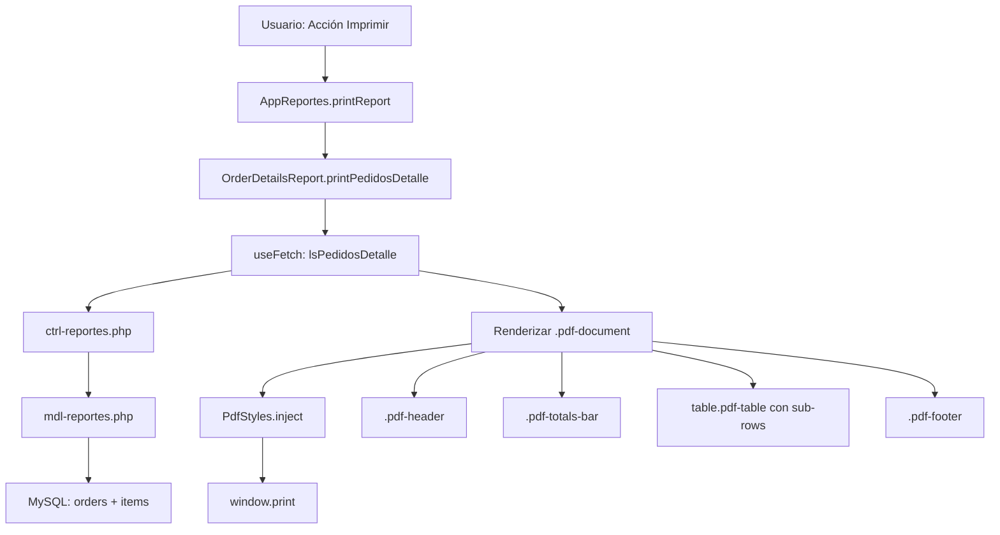

# Documento de Diseño: Pedidos Detalle PDF

## Resumen

Este documento describe el diseño técnico para implementar la funcionalidad de impresión PDF del reporte "Detalles de Pedidos". La solución reutiliza la infraestructura existente de `PdfStyles` y la estructura `.pdf-document` ya implementada en el reporte "Resumen Corte" (`SummaryReport`), añadiendo un método `printPedidosDetalle()` a la clase `OrderDetailsReport` y estilos adicionales para sub-filas de items.

## Arquitectura

La funcionalidad se integra dentro del módulo `pedidos-reportes` existente, siguiendo el mismo patrón arquitectónico del reporte de Corte de Caja:



### Decisiones de Diseño

1. **Reutilización de PdfStyles**: Se extiende la clase estática existente añadiendo reglas CSS para sub-filas (`.pdf-item-row`) en lugar de crear un nuevo sistema de estilos.
2. **Mismo endpoint**: Se reutiliza `lsPedidosDetalle` que ya retorna los datos con la estructura necesaria (pedidos + items con `opc: 0/1`).
3. **Renderizado client-side**: El HTML del PDF se genera en JavaScript y se inyecta en el contenedor existente, igual que `SummaryReport.render()`.
4. **Integración via printReport()**: Se añade un case en el switch de `AppReportes.printReport()` para la pestaña `pedidos-detalle`.

## Componentes e Interfaces

### 1. OrderDetailsReport.printPedidosDetalle()

Método asíncrono que genera la vista PDF completa.

```javascript
// Firma
async printPedidosDetalle() → void
```

**Flujo interno:**
1. Obtiene `params` via `appReportes.getFilterParams()`
2. Obtiene `subName` via `appReportes.getSubName()`
3. Hace fetch a `lsPedidosDetalle` con los params
4. Construye el HTML del `.pdf-document`
5. Inyecta en `#container-pedidos-detalle`
6. Llama a `PdfStyles.inject()`

### 2. OrderDetailsReport._renderPdfTotalsBar(totals)

Método privado que genera el HTML de la barra de totales.

```javascript
// Entrada
totals: { total_pedidos, importe, abono, saldo, efectivo, tarjeta, transferencia, descuento }

// Salida
HTML string con .total-item elements
```

### 3. OrderDetailsReport._renderPdfTable(rows)

Método privado que genera la tabla de pedidos con sub-filas de items.

```javascript
// Entrada
rows: Array de objetos con opc: 1 (pedido) o opc: 0 (item)

// Salida
HTML string con table.pdf-table incluyendo filas de pedido y sub-filas de items
```

### 4. PdfStyles.inject() — Extensión

Se añaden reglas CSS para:
- `.pdf-item-row td` — fuente reducida (11px), color atenuado (#9ca3af en dark, #7f8c8d en print)
- `.pdf-item-row` — sin borde inferior o borde más sutil

### 5. AppReportes.printReport() — Modificación

Se añade el case `'pedidos-detalle'` que invoca `orderDetailsReport.printPedidosDetalle()`.

## Modelos de Datos

### Respuesta del endpoint lsPedidosDetalle

```typescript
interface PedidosDetalleResponse {
  row: PedidoRow[];
  totals: Totals;
}

interface PedidoRow {
  id: string;           // "ped_123"
  Folio: string;        // "00000123"
  Cliente: { html: string; class: string };
  Fecha: string;
  Abono: { html: string; class: string };
  Total: { html: string; class: string };
  Saldo: { html: string; class: string };
  Entrega: string;
  Estado: { html: string; class: string };
  Entregado: { html: string; class: string };
  Tipo: { html: string; class: string };
  opc: 1;              // Fila de pedido
}

interface ItemRow {
  id: string;           // "ped_123_item_1"
  Folio: string;        // ""
  Cliente: { html: string; class: string }; // nombre x cantidad
  Fecha: string;        // ""
  Abono: string;        // ""
  Total: { html: string; class: string };   // subtotal
  Saldo: string;        // ""
  Entrega: string;      // ""
  Estado: string;       // ""
  Entregado: string;    // ""
  Tipo: string;         // ""
  opc: 0;              // Fila de item
}

interface Totals {
  importe: string;       // Formateado con evaluar()
  descuento: string;
  abono: string;
  saldo: string;
  efectivo: string;
  tarjeta: string;
  transferencia: string;
  total_pedidos: number;
}
```

### Datos extraídos para el PDF

Para el renderizado PDF, se extraen los valores de texto plano de las celdas HTML del endpoint. Las columnas mostradas en la tabla PDF son:

| Columna | Fuente | Alineación |
|---------|--------|------------|
| Folio | `row.Folio` | izquierda |
| Cliente | texto de `row.Cliente.html` | izquierda |
| Fecha | `row.Fecha` | izquierda |
| Abono | texto de `row.Abono.html` | derecha |
| Total | texto de `row.Total.html` | derecha |
| Saldo | texto de `row.Saldo.html` | derecha |
| Entrega | `row.Entrega` | izquierda |
| Estado | texto de `row.Estado.html` | centro |

Para sub-filas de items (opc: 0):
- Se muestra el nombre+cantidad en la columna Cliente
- Se muestra el subtotal en la columna Total
- Las demás columnas quedan vacías

## Manejo de Errores

| Escenario | Comportamiento |
|-----------|---------------|
| Endpoint retorna error (status 403) | No se renderiza el PDF, se mantiene la vista actual |
| `data.row` está vacío | Se muestra mensaje "No hay datos disponibles para el periodo consultado" dentro del `.pdf-document` |
| `data.totals` es null/undefined | Se muestran los totales con valor "0.00" o se omite la barra de totales |
| `PdfStyles.inject()` ya fue llamado | El método verifica si `#pdf-corte-styles` existe y no duplica estilos |
| Celda con formato HTML (`{html, class}`) | Se extrae solo el texto visible para la tabla PDF, ignorando badges/iconos de estado |

## Estrategia de Testing

### Por qué NO se aplica Property-Based Testing

Esta funcionalidad es primordialmente de **renderizado UI** (generación de HTML para vista de impresión) y **formateo de datos para presentación**. No existen funciones puras con variación significativa de inputs que justifiquen 100+ iteraciones de PBT. Las razones específicas:

1. El método `printPedidosDetalle()` genera HTML estático a partir de datos ya formateados por el backend
2. No hay transformaciones algorítmicas complejas — es mapeo directo de datos a celdas HTML
3. Los estilos CSS son declarativos y se validan visualmente
4. La integración con `printReport()` es un simple switch case

### Tests Recomendados

**Unit Tests (example-based):**
- Verificar que `printPedidosDetalle()` genera la estructura HTML correcta (`.pdf-document`, `.pdf-header`, `.pdf-totals-bar`, `.pdf-table`, `.pdf-footer`)
- Verificar que las sub-filas de items tienen la clase `.pdf-item-row`
- Verificar que cuando `data.row` está vacío se muestra el mensaje de "sin datos"
- Verificar que `_renderPdfTotalsBar()` genera los 8 indicadores correctos
- Verificar que el indicador "Importe Total" tiene la clase `highlight`
- Verificar que `printReport()` invoca `printPedidosDetalle()` cuando `currentTab === 'pedidos-detalle'`

**Integration Tests:**
- Verificar que el fetch a `lsPedidosDetalle` se realiza con los filtros correctos
- Verificar que `PdfStyles.inject()` se invoca después del renderizado

**Visual/Manual Tests:**
- Verificar modo oscuro en pantalla (fondo `#1a1f2e`, texto claro)
- Verificar modo claro en impresión (fondo blanco, texto oscuro)
- Verificar que sub-filas de items se ven con fuente reducida y color atenuado
- Verificar que el botón "Imprimir" ejecuta `window.print()`
- Verificar que elementos de navegación se ocultan al imprimir

