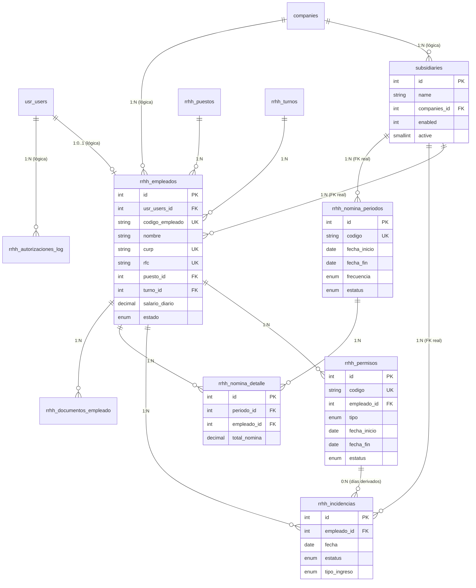

# Propuesta de Base de Datos – Módulo RRHH Huubie

> **Versión:** 1.0
> **Fase:** 1 – Modelo de datos propuesto
> **Fecha:** Abril 2026
> **Módulo:** `alpha/rrhh/`
> **Documento relacionado:** [`ERS.md`](ERS.md)

---

## 1. Decisiones macro

### 1.1 Base de datos nueva: `fayxzvov_rrhh`

**Decisión:** crear una base de datos **nueva e independiente** llamada `fayxzvov_rrhh`, en lugar de agregar las tablas al esquema `fayxzvov_admin` o `fayxzvov_alpha` existentes.

**Razones:**

1. **Aislamiento de datos sensibles.** RRHH maneja información confidencial (salarios, CURP, RFC, NSS, cuentas bancarias). Separarla en una base dedicada facilita aplicar permisos MySQL específicos, rotar credenciales, hacer backups diferenciados y cumplir auditorías.
2. **Consistencia con el patrón del proyecto.** `alpha/pedidos/` usa `fayxzvov_reginas` como BD del dominio del negocio y cruza joins a `fayxzvov_alpha` / `fayxzvov_admin` para usuarios y sucursales. RRHH seguirá exactamente el mismo patrón.
3. **Volumetría previsible.** Las incidencias diarias generan un registro por colaborador por día → para una empresa de 200 personas son 200 × 365 = 73,000 filas por año solo en `rrhh_incidencias`. No conviene contaminar `fayxzvov_admin` con esa volumetría.
4. **Migraciones independientes.** El archivo `alpha/rrhh/sql/create_database.sql` (Fase 2) podrá evolucionar sin tocar los esquemas de otros módulos.

### 1.2 `rrhh_empleados` como tabla satélite de `usr_users`

**Decisión:** crear `rrhh_empleados` como **tabla nueva con FK lógica** a `usr_users.id`, permitiendo NULL. **NO modificar `usr_users`**.

**Razones:**

1. **No todos los `usr_users` son empleados.** Pueden existir cuentas técnicas, integraciones, superadmins externos que no deben aparecer en la nómina.
2. **No todos los empleados tienen login.** Personal de cocina, limpieza o eventual puede estar registrado en RRHH sin tener acceso al sistema (en ese caso `usr_users_id` es NULL).
3. **Aislamos cambios de esquema del core.** Cualquier adición de columna laboral (bonos fijos, comisiones, parentesco con beneficiarios, etc.) ocurre en `rrhh_empleados` y no toca tablas compartidas con otros módulos.
4. **Portabilidad.** Si mañana el core migra de `usr_users` a otro sistema de identidad (OAuth, SSO), solo se actualiza el campo `usr_users_id` sin tocar el esquema laboral.

### 1.3 `subsidiaries` como tabla propia en `fayxzvov_rrhh`

**Decisión:** copiar la estructura de `fayxzvov_alpha.subsidiaries` a `fayxzvov_rrhh` como `subsidiaries`. La tabla `companies` permanece en `fayxzvov_admin` (FK lógica).

**Razones:**

1. **Independencia del módulo.** RRHH no debe depender de la BD de alpha para funcionar. Si alpha migra o cambia la tabla, RRHH no se rompe.
2. **FKs reales.** Al estar en la misma BD, `rrhh_empleados.subsidiaries_id`, `rrhh_incidencias.subsidiaries_id` y `rrhh_nomina_periodos.subsidiaries_id` pueden tener `FOREIGN KEY` enforzada por MySQL, garantizando integridad referencial.
3. **Sincronización.** Los datos de sucursales se sincronizan desde alpha a rrhh mediante lógica de negocio (Fase 2), manteniendo ambas tablas consistentes.

### 1.4 FKs cross-database restantes = FKs lógicas

MySQL **no valida** `FOREIGN KEY` entre bases de datos distintas. Las referencias restantes como `rrhh_empleados.usr_users_id` → `fayxzvov_alpha.usr_users.id` o `subsidiaries.companies_id` → `fayxzvov_admin.companies.id` son **FKs lógicas**: se documentan en este archivo y se validan en los modelos PHP antes de cada `INSERT` o `UPDATE`. No se declaran con `FOREIGN KEY` en el DDL.

### 1.5 Conexión

| Parámetro | Valor |
|---|---|
| Host | `localhost` (dev) / configurable en prod |
| Usuario | `root` (dev) / dedicado `huubie_rrhh` en prod |
| Base | `fayxzvov_rrhh` |
| Charset | `utf8mb4_unicode_ci` |
| Engine | `InnoDB` |
| Modo | `PDO::MYSQL_ATTR_INIT_COMMAND = SET NAMES utf8mb4` |

En `alpha/rrhh/mdl/mdl-rrhh.php` (Fase 2), el prefijo será `$this->bd = 'fayxzvov_rrhh.'` igual al patrón que usa `mdl-pedidos.php` con `fayxzvov_reginas.`.

---

## 2. Catálogo de tablas

### 2.1 `subsidiaries`

**Propósito:** Copia local de sucursales dentro de `fayxzvov_rrhh`. Estructura idéntica a `fayxzvov_alpha.subsidiaries` para permitir FKs reales dentro de la misma BD.

| Columna | Tipo | Null | Default | Nota |
|---|---|---|---|---|
| `id` | INT AI PK | NO | | Mismo ID que en `fayxzvov_alpha.subsidiaries` |
| `name` | VARCHAR(200) | YES | NULL | Nombre de la sucursal |
| `companies_id` | INT | YES | NULL | FK lógica → `fayxzvov_admin.companies.id` |
| `enabled` | INT | YES | 1 | |
| `logo` | TEXT | YES | NULL | |
| `ubication` | TEXT | YES | NULL | |
| `active` | SMALLINT | YES | 0 | |
| `date_creation` | DATETIME | YES | NULL | |

**Índices:** `INDEX(companies_id)`, `INDEX(active)`.

**Nota:** Los datos se sincronizan desde `fayxzvov_alpha.subsidiaries` (Fase 2). Los IDs deben coincidir para mantener consistencia.

---

### 2.2 `rrhh_puestos` (antes 2.1)

**Propósito:** Catálogo de puestos/cargos disponibles en la organización.

| Columna | Tipo | Null | Default | Nota |
|---|---|---|---|---|
| `id` | INT UNSIGNED AI PK | NO | | |
| `nombre` | VARCHAR(80) | NO | | Ej. "Administrador", "Cocina", "Piso", "Mesero", "Barista" |
| `descripcion` | TEXT | YES | NULL | Responsabilidades del puesto |
| `color_badge` | VARCHAR(20) | YES | 'gray' | Clave para render: 'purple', 'blue', 'gray', 'orange' |
| `icono` | VARCHAR(50) | YES | NULL | Clase fontello/fa |
| `salario_base_sugerido` | DECIMAL(10,2) | YES | NULL | Referencia para altas |
| `active` | TINYINT(1) | NO | 1 | |
| `created_at` | TIMESTAMP | NO | CURRENT_TIMESTAMP | |
| `updated_at` | TIMESTAMP | NO | CURRENT_TIMESTAMP ON UPDATE | |

**Índices:** `UNIQUE(nombre)`, `INDEX(active)`.

---

### 2.2 `rrhh_turnos`

**Propósito:** Catálogo de turnos laborales con horarios y tolerancia de retardo.

| Columna | Tipo | Null | Default | Nota |
|---|---|---|---|---|
| `id` | INT UNSIGNED AI PK | NO | | |
| `nombre` | VARCHAR(40) | NO | | "Matutino", "Vespertino", "Nocturno", "Mixto" |
| `hora_entrada` | TIME | NO | | |
| `hora_salida` | TIME | NO | | |
| `tolerancia_retardo_min` | INT(3) | NO | 10 | Minutos antes de marcar como retardo |
| `duracion_horas` | DECIMAL(4,2) | NO | 8.00 | Para cálculos de nómina |
| `active` | TINYINT(1) | NO | 1 | |
| `created_at` | TIMESTAMP | NO | CURRENT_TIMESTAMP | |
| `updated_at` | TIMESTAMP | NO | CURRENT_TIMESTAMP ON UPDATE | |

**Índices:** `UNIQUE(nombre)`.

---

### 2.3 `rrhh_empleados`

**Propósito:** Datos laborales del colaborador. Satélite de `usr_users` con FK lógica.

| Columna | Tipo | Null | Default | Nota |
|---|---|---|---|---|
| `id` | INT UNSIGNED AI PK | NO | | |
| `usr_users_id` | INT UNSIGNED | YES | NULL | FK lógica a `fayxzvov_alpha.usr_users.id`. NULL si no tiene login |
| `codigo_empleado` | VARCHAR(20) | NO | | "EMP-0001", auto-generado |
| `nombre` | VARCHAR(80) | NO | | |
| `apellido_paterno` | VARCHAR(80) | NO | | |
| `apellido_materno` | VARCHAR(80) | YES | NULL | |
| `foto_url` | VARCHAR(255) | YES | NULL | Ruta en servidor |
| `email` | VARCHAR(120) | YES | NULL | |
| `telefono` | VARCHAR(20) | YES | NULL | |
| `fecha_nacimiento` | DATE | YES | NULL | |
| `curp` | VARCHAR(18) | YES | NULL | Validar formato MX server-side |
| `rfc` | VARCHAR(13) | YES | NULL | |
| `nss` | VARCHAR(11) | YES | NULL | |
| `cuenta_bancaria` | VARCHAR(20) | YES | NULL | |
| `banco` | VARCHAR(40) | YES | NULL | |
| `puesto_id` | INT UNSIGNED | NO | | FK → `rrhh_puestos.id` |
| `turno_id` | INT UNSIGNED | NO | | FK → `rrhh_turnos.id` |
| `subsidiaries_id` | INT UNSIGNED | NO | | FK → `subsidiaries.id` |
| `companies_id` | INT UNSIGNED | NO | | FK lógica → `fayxzvov_admin.companies.id` |
| `tipo_contrato` | ENUM('indefinido','temporal','honorarios','eventual') | NO | 'indefinido' | |
| `fecha_ingreso` | DATE | NO | | |
| `fecha_baja` | DATE | YES | NULL | |
| `motivo_baja` | TEXT | YES | NULL | |
| `salario_diario` | DECIMAL(10,2) | NO | 0.00 | Edición requiere RF-06 |
| `frecuencia_pago` | ENUM('semanal','catorcenal','quincenal','mensual') | NO | 'quincenal' | |
| `estado` | ENUM('activo','baja','suspendido') | NO | 'activo' | |
| `notas` | TEXT | YES | NULL | |
| `created_at` | TIMESTAMP | NO | CURRENT_TIMESTAMP | |
| `created_by` | INT UNSIGNED | NO | | usr_users_id del creador |
| `updated_at` | TIMESTAMP | NO | CURRENT_TIMESTAMP ON UPDATE | |
| `updated_by` | INT UNSIGNED | YES | NULL | |

**Índices:**
- `UNIQUE(codigo_empleado)`
- `UNIQUE(curp)` (permitiendo NULL)
- `UNIQUE(rfc)` (permitiendo NULL)
- `INDEX(usr_users_id)`
- `INDEX(puesto_id)`
- `INDEX(turno_id)`
- `INDEX(subsidiaries_id)`
- `INDEX(estado)`
- `INDEX(fecha_ingreso)`

**FKs enforzadas (dentro de la misma BD):**
- `puesto_id` → `rrhh_puestos(id)` ON DELETE RESTRICT
- `turno_id` → `rrhh_turnos(id)` ON DELETE RESTRICT
- `subsidiaries_id` → `subsidiaries(id)` ON DELETE RESTRICT

---

### 2.4 `rrhh_permisos`

**Propósito:** Registro de solicitudes de permisos (vacaciones / incapacidad / permiso especial).

| Columna | Tipo | Null | Default | Nota |
|---|---|---|---|---|
| `id` | INT UNSIGNED AI PK | NO | | |
| `codigo` | VARCHAR(20) | NO | | "PC-0001" auto-generado |
| `empleado_id` | INT UNSIGNED | NO | | FK → `rrhh_empleados.id` |
| `tipo` | ENUM('incapacidad','vacaciones','permiso') | NO | | |
| `fecha_inicio` | DATE | NO | | |
| `fecha_fin` | DATE | NO | | |
| `dias` | INT(3) | NO | | Calculado (fecha_fin - fecha_inicio + 1) |
| `razon` | TEXT | YES | NULL | |
| `estatus` | ENUM('pendiente','aprobado','rechazado','sin_estatus') | NO | 'pendiente' | |
| `solicitud_file` | VARCHAR(255) | YES | NULL | Ruta archivo PDF/JPG |
| `comprobante_file` | VARCHAR(255) | YES | NULL | Ruta archivo PDF/JPG |
| `solicitado_por` | INT UNSIGNED | NO | | usr_users_id |
| `aprobado_por` | INT UNSIGNED | YES | NULL | usr_users_id |
| `aprobado_at` | DATETIME | YES | NULL | |
| `rechazado_por` | INT UNSIGNED | YES | NULL | usr_users_id |
| `rechazado_at` | DATETIME | YES | NULL | |
| `observaciones_aprobador` | TEXT | YES | NULL | |
| `created_at` | TIMESTAMP | NO | CURRENT_TIMESTAMP | |
| `updated_at` | TIMESTAMP | NO | CURRENT_TIMESTAMP ON UPDATE | |

**Índices:**
- `UNIQUE(codigo)`
- `INDEX(empleado_id)`
- `INDEX(tipo)`
- `INDEX(estatus)`
- `INDEX(fecha_inicio, fecha_fin)`

**FKs:** `empleado_id` → `rrhh_empleados(id)` ON DELETE CASCADE.

---

### 2.5 `rrhh_incidencias`

**Propósito:** Registro diario de asistencia por colaborador. Una fila por colaborador por día.

| Columna | Tipo | Null | Default | Nota |
|---|---|---|---|---|
| `id` | INT UNSIGNED AI PK | NO | | |
| `empleado_id` | INT UNSIGNED | NO | | FK → `rrhh_empleados.id` |
| `fecha` | DATE | NO | | |
| `tipo_ingreso` | ENUM('manual','automatico','biometrico','importado') | NO | 'manual' | |
| `hora_entrada` | TIME | YES | NULL | |
| `hora_salida` | TIME | YES | NULL | |
| `estatus` | ENUM('atiempo','retardo','falta','sin_estatus','vacaciones','incapacidad','reconocimiento') | NO | 'sin_estatus' | |
| `minutos_tarde` | INT(4) | NO | 0 | |
| `observaciones` | TEXT | YES | NULL | |
| `registrado_por` | INT UNSIGNED | YES | NULL | usr_users_id (si manual) |
| `permiso_id` | INT UNSIGNED | YES | NULL | FK → `rrhh_permisos.id` si viene de un permiso aprobado |
| `subsidiaries_id` | INT UNSIGNED | NO | | Denormalizado para filtros rápidos |
| `created_at` | TIMESTAMP | NO | CURRENT_TIMESTAMP | |
| `updated_at` | TIMESTAMP | NO | CURRENT_TIMESTAMP ON UPDATE | |

**Índices:**
- `UNIQUE(empleado_id, fecha)` ← garantiza un solo registro por día
- `INDEX(fecha)`
- `INDEX(estatus)`
- `INDEX(subsidiaries_id, fecha)`
- `INDEX(permiso_id)`

**FKs:**
- `empleado_id` → `rrhh_empleados(id)` ON DELETE CASCADE
- `permiso_id` → `rrhh_permisos(id)` ON DELETE SET NULL

---

### 2.6 `rrhh_nomina_periodos`

**Propósito:** Periodo fiscal de cálculo de nómina.

| Columna | Tipo | Null | Default | Nota |
|---|---|---|---|---|
| `id` | INT UNSIGNED AI PK | NO | | |
| `codigo` | VARCHAR(30) | NO | | "NOM-2024-Q15" |
| `subsidiaries_id` | INT UNSIGNED | NO | | FK lógica |
| `companies_id` | INT UNSIGNED | NO | | FK lógica |
| `fecha_inicio` | DATE | NO | | |
| `fecha_fin` | DATE | NO | | |
| `frecuencia` | ENUM('semanal','catorcenal','quincenal','mensual') | NO | | |
| `estatus` | ENUM('abierta','calculada','aprobada','pagada','cancelada') | NO | 'abierta' | |
| `total_efectivo` | DECIMAL(12,2) | NO | 0.00 | |
| `total_bancos` | DECIMAL(12,2) | NO | 0.00 | |
| `total_general` | DECIMAL(12,2) | NO | 0.00 | |
| `total_colaboradores` | INT(5) | NO | 0 | |
| `calculado_por` | INT UNSIGNED | YES | NULL | |
| `calculado_at` | DATETIME | YES | NULL | |
| `aprobado_por` | INT UNSIGNED | YES | NULL | |
| `aprobado_at` | DATETIME | YES | NULL | |
| `pagado_at` | DATETIME | YES | NULL | |
| `notas` | TEXT | YES | NULL | |
| `created_at` | TIMESTAMP | NO | CURRENT_TIMESTAMP | |
| `updated_at` | TIMESTAMP | NO | CURRENT_TIMESTAMP ON UPDATE | |

**Índices:**
- `UNIQUE(codigo)`
- `INDEX(subsidiaries_id, fecha_inicio, fecha_fin)`
- `INDEX(estatus)`

---

### 2.7 `rrhh_nomina_detalle`

**Propósito:** Una fila por colaborador por periodo con el desglose del cálculo de nómina.

| Columna | Tipo | Null | Default | Nota |
|---|---|---|---|---|
| `id` | INT UNSIGNED AI PK | NO | | |
| `periodo_id` | INT UNSIGNED | NO | | FK → `rrhh_nomina_periodos.id` ON DELETE CASCADE |
| `empleado_id` | INT UNSIGNED | NO | | FK → `rrhh_empleados.id` |
| `dias_laborados` | DECIMAL(4,2) | NO | 0 | |
| `dias_faltas` | DECIMAL(4,2) | NO | 0 | |
| `dias_vacaciones` | DECIMAL(4,2) | NO | 0 | |
| `dias_incapacidad` | DECIMAL(4,2) | NO | 0 | |
| `sueldo_diario` | DECIMAL(10,2) | NO | 0 | Snapshot al momento del cálculo |
| `salario_total` | DECIMAL(12,2) | NO | 0 | `dias_laborados * sueldo_diario` |
| `bonos` | DECIMAL(10,2) | NO | 0 | |
| `incentivos` | DECIMAL(10,2) | NO | 0 | |
| `descuentos` | DECIMAL(10,2) | NO | 0 | |
| `faltas_retardos_descuento` | DECIMAL(10,2) | NO | 0 | `dias_faltas * sueldo_diario` |
| `extras` | DECIMAL(10,2) | NO | 0 | Horas extras, prima vacacional |
| `a_pagar_efectivo` | DECIMAL(10,2) | NO | 0 | |
| `a_pagar_bancos` | DECIMAL(10,2) | NO | 0 | |
| `total_nomina` | DECIMAL(10,2) | NO | 0 | |
| `observaciones` | TEXT | YES | NULL | |
| `recibo_numero` | VARCHAR(20) | YES | NULL | "#1" al aprobar |
| `recibo_url` | VARCHAR(255) | YES | NULL | PDF generado (Fase posterior) |
| `created_at` | TIMESTAMP | NO | CURRENT_TIMESTAMP | |
| `updated_at` | TIMESTAMP | NO | CURRENT_TIMESTAMP ON UPDATE | |

**Índices:**
- `UNIQUE(periodo_id, empleado_id)`
- `INDEX(empleado_id)`
- `INDEX(periodo_id)`

**FKs:**
- `periodo_id` → `rrhh_nomina_periodos(id)` ON DELETE CASCADE
- `empleado_id` → `rrhh_empleados(id)` ON DELETE RESTRICT

---

### 2.8 `rrhh_autorizaciones_log`

**Propósito:** Registro de auditoría de cambios que requirieron password (RF-06).

| Columna | Tipo | Null | Default | Nota |
|---|---|---|---|---|
| `id` | BIGINT UNSIGNED AI PK | NO | | |
| `usr_users_id` | INT UNSIGNED | NO | | Quién autorizó |
| `accion` | VARCHAR(80) | NO | | "aprobar_permiso", "aprobar_nomina", "cambiar_estatus_incidencia", "editar_salario", "dar_baja_empleado" |
| `tabla_afectada` | VARCHAR(60) | NO | | "rrhh_permisos", "rrhh_nomina_periodos", etc. |
| `registro_id` | INT UNSIGNED | NO | | ID del registro afectado |
| `valor_anterior` | TEXT | YES | NULL | JSON del estado antes del cambio |
| `valor_nuevo` | TEXT | YES | NULL | JSON del estado después del cambio |
| `ip` | VARCHAR(45) | YES | NULL | IPv4 o IPv6 |
| `user_agent` | VARCHAR(255) | YES | NULL | |
| `created_at` | TIMESTAMP | NO | CURRENT_TIMESTAMP | |

**Índices:**
- `INDEX(usr_users_id)`
- `INDEX(accion)`
- `INDEX(tabla_afectada, registro_id)`
- `INDEX(created_at)`

---

### 2.9 `rrhh_documentos_empleado`

**Propósito:** Archivos del expediente del colaborador (INE, CURP, RFC, NSS, contrato, comprobante de domicilio, etc.).

| Columna | Tipo | Null | Default | Nota |
|---|---|---|---|---|
| `id` | INT UNSIGNED AI PK | NO | | |
| `empleado_id` | INT UNSIGNED | NO | | FK → `rrhh_empleados.id` ON DELETE CASCADE |
| `tipo_documento` | ENUM('ine','curp','rfc','nss','contrato','comprobante_domicilio','acta_nacimiento','titulo','otros') | NO | | |
| `nombre_archivo` | VARCHAR(255) | NO | | Nombre original del archivo |
| `archivo_url` | VARCHAR(255) | NO | | Ruta en servidor |
| `tamano_bytes` | INT | YES | NULL | |
| `mime_type` | VARCHAR(60) | YES | NULL | |
| `fecha_vencimiento` | DATE | YES | NULL | Para docs que expiran (INE, licencia) |
| `subido_por` | INT UNSIGNED | NO | | usr_users_id |
| `created_at` | TIMESTAMP | NO | CURRENT_TIMESTAMP | |

**Índices:**
- `INDEX(empleado_id, tipo_documento)`
- `INDEX(fecha_vencimiento)`

**FKs:** `empleado_id` → `rrhh_empleados(id)` ON DELETE CASCADE.

---

## 3. Diagrama de relaciones



---

## 4. DDL sugerido (referencia – NO ejecutar en Fase 1)

El siguiente bloque SQL es una **referencia** para cuando se escriba `alpha/rrhh/sql/create_database.sql` en Fase 2. No debe ejecutarse en esta fase.

```sql
-- ============================================================
-- BASE DE DATOS: fayxzvov_rrhh
-- Módulo: Recursos Humanos – Huubie
-- ============================================================

CREATE DATABASE IF NOT EXISTS `fayxzvov_rrhh`
  DEFAULT CHARACTER SET utf8mb4
  DEFAULT COLLATE utf8mb4_unicode_ci;

USE `fayxzvov_rrhh`;

-- ============================================================
-- 0. SUCURSALES (copia de fayxzvov_alpha.subsidiaries)
-- ============================================================

CREATE TABLE `subsidiaries` (
  `id` INT NOT NULL AUTO_INCREMENT,
  `name` VARCHAR(200) DEFAULT NULL,
  `companies_id` INT DEFAULT NULL COMMENT 'FK lógica → fayxzvov_admin.companies.id',
  `enabled` INT DEFAULT '1',
  `logo` TEXT,
  `ubication` TEXT,
  `active` SMALLINT DEFAULT '0',
  `date_creation` DATETIME DEFAULT NULL,
  PRIMARY KEY (`id`),
  KEY `idx_subsidiaries_company` (`companies_id`),
  KEY `idx_subsidiaries_active` (`active`)
) ENGINE=InnoDB DEFAULT CHARSET=utf8mb4 COLLATE=utf8mb4_unicode_ci;

-- ============================================================
-- 1. CATÁLOGOS
-- ============================================================

CREATE TABLE `rrhh_puestos` (
  `id` INT UNSIGNED NOT NULL AUTO_INCREMENT,
  `nombre` VARCHAR(80) NOT NULL,
  `descripcion` TEXT NULL,
  `color_badge` VARCHAR(20) DEFAULT 'gray',
  `icono` VARCHAR(50) NULL,
  `salario_base_sugerido` DECIMAL(10,2) NULL,
  `active` TINYINT(1) NOT NULL DEFAULT 1,
  `created_at` TIMESTAMP NOT NULL DEFAULT CURRENT_TIMESTAMP,
  `updated_at` TIMESTAMP NOT NULL DEFAULT CURRENT_TIMESTAMP ON UPDATE CURRENT_TIMESTAMP,
  PRIMARY KEY (`id`),
  UNIQUE KEY `uk_rrhh_puestos_nombre` (`nombre`),
  KEY `idx_rrhh_puestos_active` (`active`)
) ENGINE=InnoDB DEFAULT CHARSET=utf8mb4 COLLATE=utf8mb4_unicode_ci;

CREATE TABLE `rrhh_turnos` (
  `id` INT UNSIGNED NOT NULL AUTO_INCREMENT,
  `nombre` VARCHAR(40) NOT NULL,
  `hora_entrada` TIME NOT NULL,
  `hora_salida` TIME NOT NULL,
  `tolerancia_retardo_min` INT(3) NOT NULL DEFAULT 10,
  `duracion_horas` DECIMAL(4,2) NOT NULL DEFAULT 8.00,
  `active` TINYINT(1) NOT NULL DEFAULT 1,
  `created_at` TIMESTAMP NOT NULL DEFAULT CURRENT_TIMESTAMP,
  `updated_at` TIMESTAMP NOT NULL DEFAULT CURRENT_TIMESTAMP ON UPDATE CURRENT_TIMESTAMP,
  PRIMARY KEY (`id`),
  UNIQUE KEY `uk_rrhh_turnos_nombre` (`nombre`)
) ENGINE=InnoDB DEFAULT CHARSET=utf8mb4 COLLATE=utf8mb4_unicode_ci;

-- ============================================================
-- 2. EMPLEADOS
-- ============================================================

CREATE TABLE `rrhh_empleados` (
  `id` INT UNSIGNED NOT NULL AUTO_INCREMENT,
  `usr_users_id` INT UNSIGNED NULL COMMENT 'FK lógica a fayxzvov_alpha.usr_users.id',
  `codigo_empleado` VARCHAR(20) NOT NULL,
  `nombre` VARCHAR(80) NOT NULL,
  `apellido_paterno` VARCHAR(80) NOT NULL,
  `apellido_materno` VARCHAR(80) NULL,
  `foto_url` VARCHAR(255) NULL,
  `email` VARCHAR(120) NULL,
  `telefono` VARCHAR(20) NULL,
  `fecha_nacimiento` DATE NULL,
  `curp` VARCHAR(18) NULL,
  `rfc` VARCHAR(13) NULL,
  `nss` VARCHAR(11) NULL,
  `cuenta_bancaria` VARCHAR(20) NULL,
  `banco` VARCHAR(40) NULL,
  `puesto_id` INT UNSIGNED NOT NULL,
  `turno_id` INT UNSIGNED NOT NULL,
  `subsidiaries_id` INT NOT NULL COMMENT 'FK → subsidiaries.id',
  `companies_id` INT UNSIGNED NOT NULL COMMENT 'FK lógica → fayxzvov_admin.companies.id',
  `tipo_contrato` ENUM('indefinido','temporal','honorarios','eventual') NOT NULL DEFAULT 'indefinido',
  `fecha_ingreso` DATE NOT NULL,
  `fecha_baja` DATE NULL,
  `motivo_baja` TEXT NULL,
  `salario_diario` DECIMAL(10,2) NOT NULL DEFAULT 0.00,
  `frecuencia_pago` ENUM('semanal','catorcenal','quincenal','mensual') NOT NULL DEFAULT 'quincenal',
  `estado` ENUM('activo','baja','suspendido') NOT NULL DEFAULT 'activo',
  `notas` TEXT NULL,
  `created_at` TIMESTAMP NOT NULL DEFAULT CURRENT_TIMESTAMP,
  `created_by` INT UNSIGNED NOT NULL,
  `updated_at` TIMESTAMP NOT NULL DEFAULT CURRENT_TIMESTAMP ON UPDATE CURRENT_TIMESTAMP,
  `updated_by` INT UNSIGNED NULL,
  PRIMARY KEY (`id`),
  UNIQUE KEY `uk_rrhh_empleados_codigo` (`codigo_empleado`),
  UNIQUE KEY `uk_rrhh_empleados_curp` (`curp`),
  UNIQUE KEY `uk_rrhh_empleados_rfc` (`rfc`),
  KEY `idx_rrhh_empleados_usr` (`usr_users_id`),
  KEY `idx_rrhh_empleados_puesto` (`puesto_id`),
  KEY `idx_rrhh_empleados_turno` (`turno_id`),
  KEY `idx_rrhh_empleados_sub` (`subsidiaries_id`),
  KEY `idx_rrhh_empleados_estado` (`estado`),
  KEY `idx_rrhh_empleados_ingreso` (`fecha_ingreso`),
  CONSTRAINT `fk_rrhh_empleados_puesto` FOREIGN KEY (`puesto_id`) REFERENCES `rrhh_puestos`(`id`) ON DELETE RESTRICT,
  CONSTRAINT `fk_rrhh_empleados_turno` FOREIGN KEY (`turno_id`) REFERENCES `rrhh_turnos`(`id`) ON DELETE RESTRICT,
  CONSTRAINT `fk_rrhh_empleados_sub` FOREIGN KEY (`subsidiaries_id`) REFERENCES `subsidiaries`(`id`) ON DELETE RESTRICT
) ENGINE=InnoDB DEFAULT CHARSET=utf8mb4 COLLATE=utf8mb4_unicode_ci;

-- ============================================================
-- 3. PERMISOS
-- ============================================================

CREATE TABLE `rrhh_permisos` (
  `id` INT UNSIGNED NOT NULL AUTO_INCREMENT,
  `codigo` VARCHAR(20) NOT NULL,
  `empleado_id` INT UNSIGNED NOT NULL,
  `tipo` ENUM('incapacidad','vacaciones','permiso') NOT NULL,
  `fecha_inicio` DATE NOT NULL,
  `fecha_fin` DATE NOT NULL,
  `dias` INT(3) NOT NULL,
  `razon` TEXT NULL,
  `estatus` ENUM('pendiente','aprobado','rechazado','sin_estatus') NOT NULL DEFAULT 'pendiente',
  `solicitud_file` VARCHAR(255) NULL,
  `comprobante_file` VARCHAR(255) NULL,
  `solicitado_por` INT UNSIGNED NOT NULL,
  `aprobado_por` INT UNSIGNED NULL,
  `aprobado_at` DATETIME NULL,
  `rechazado_por` INT UNSIGNED NULL,
  `rechazado_at` DATETIME NULL,
  `observaciones_aprobador` TEXT NULL,
  `created_at` TIMESTAMP NOT NULL DEFAULT CURRENT_TIMESTAMP,
  `updated_at` TIMESTAMP NOT NULL DEFAULT CURRENT_TIMESTAMP ON UPDATE CURRENT_TIMESTAMP,
  PRIMARY KEY (`id`),
  UNIQUE KEY `uk_rrhh_permisos_codigo` (`codigo`),
  KEY `idx_rrhh_permisos_empleado` (`empleado_id`),
  KEY `idx_rrhh_permisos_tipo` (`tipo`),
  KEY `idx_rrhh_permisos_estatus` (`estatus`),
  KEY `idx_rrhh_permisos_fechas` (`fecha_inicio`, `fecha_fin`),
  CONSTRAINT `fk_rrhh_permisos_empleado` FOREIGN KEY (`empleado_id`) REFERENCES `rrhh_empleados`(`id`) ON DELETE CASCADE
) ENGINE=InnoDB DEFAULT CHARSET=utf8mb4 COLLATE=utf8mb4_unicode_ci;

-- ============================================================
-- 4. INCIDENCIAS
-- ============================================================

CREATE TABLE `rrhh_incidencias` (
  `id` INT UNSIGNED NOT NULL AUTO_INCREMENT,
  `empleado_id` INT UNSIGNED NOT NULL,
  `fecha` DATE NOT NULL,
  `tipo_ingreso` ENUM('manual','automatico','biometrico','importado') NOT NULL DEFAULT 'manual',
  `hora_entrada` TIME NULL,
  `hora_salida` TIME NULL,
  `estatus` ENUM('atiempo','retardo','falta','sin_estatus','vacaciones','incapacidad','reconocimiento') NOT NULL DEFAULT 'sin_estatus',
  `minutos_tarde` INT(4) NOT NULL DEFAULT 0,
  `observaciones` TEXT NULL,
  `registrado_por` INT UNSIGNED NULL,
  `permiso_id` INT UNSIGNED NULL,
  `subsidiaries_id` INT NOT NULL,
  `created_at` TIMESTAMP NOT NULL DEFAULT CURRENT_TIMESTAMP,
  `updated_at` TIMESTAMP NOT NULL DEFAULT CURRENT_TIMESTAMP ON UPDATE CURRENT_TIMESTAMP,
  PRIMARY KEY (`id`),
  UNIQUE KEY `uk_rrhh_incidencias_emp_fecha` (`empleado_id`, `fecha`),
  KEY `idx_rrhh_incidencias_fecha` (`fecha`),
  KEY `idx_rrhh_incidencias_estatus` (`estatus`),
  KEY `idx_rrhh_incidencias_sub_fecha` (`subsidiaries_id`, `fecha`),
  KEY `idx_rrhh_incidencias_permiso` (`permiso_id`),
  CONSTRAINT `fk_rrhh_incidencias_empleado` FOREIGN KEY (`empleado_id`) REFERENCES `rrhh_empleados`(`id`) ON DELETE CASCADE,
  CONSTRAINT `fk_rrhh_incidencias_permiso` FOREIGN KEY (`permiso_id`) REFERENCES `rrhh_permisos`(`id`) ON DELETE SET NULL,
  CONSTRAINT `fk_rrhh_incidencias_sub` FOREIGN KEY (`subsidiaries_id`) REFERENCES `subsidiaries`(`id`) ON DELETE RESTRICT
) ENGINE=InnoDB DEFAULT CHARSET=utf8mb4 COLLATE=utf8mb4_unicode_ci;

-- ============================================================
-- 5. NÓMINA
-- ============================================================

CREATE TABLE `rrhh_nomina_periodos` (
  `id` INT UNSIGNED NOT NULL AUTO_INCREMENT,
  `codigo` VARCHAR(30) NOT NULL,
  `subsidiaries_id` INT NOT NULL,
  `companies_id` INT UNSIGNED NOT NULL COMMENT 'FK lógica → fayxzvov_admin.companies.id',
  `fecha_inicio` DATE NOT NULL,
  `fecha_fin` DATE NOT NULL,
  `frecuencia` ENUM('semanal','catorcenal','quincenal','mensual') NOT NULL,
  `estatus` ENUM('abierta','calculada','aprobada','pagada','cancelada') NOT NULL DEFAULT 'abierta',
  `total_efectivo` DECIMAL(12,2) NOT NULL DEFAULT 0.00,
  `total_bancos` DECIMAL(12,2) NOT NULL DEFAULT 0.00,
  `total_general` DECIMAL(12,2) NOT NULL DEFAULT 0.00,
  `total_colaboradores` INT(5) NOT NULL DEFAULT 0,
  `calculado_por` INT UNSIGNED NULL,
  `calculado_at` DATETIME NULL,
  `aprobado_por` INT UNSIGNED NULL,
  `aprobado_at` DATETIME NULL,
  `pagado_at` DATETIME NULL,
  `notas` TEXT NULL,
  `created_at` TIMESTAMP NOT NULL DEFAULT CURRENT_TIMESTAMP,
  `updated_at` TIMESTAMP NOT NULL DEFAULT CURRENT_TIMESTAMP ON UPDATE CURRENT_TIMESTAMP,
  PRIMARY KEY (`id`),
  UNIQUE KEY `uk_rrhh_nomina_periodos_codigo` (`codigo`),
  KEY `idx_rrhh_nomina_periodos_sub_fechas` (`subsidiaries_id`, `fecha_inicio`, `fecha_fin`),
  KEY `idx_rrhh_nomina_periodos_estatus` (`estatus`),
  CONSTRAINT `fk_rrhh_nomina_periodos_sub` FOREIGN KEY (`subsidiaries_id`) REFERENCES `subsidiaries`(`id`) ON DELETE RESTRICT
) ENGINE=InnoDB DEFAULT CHARSET=utf8mb4 COLLATE=utf8mb4_unicode_ci;

CREATE TABLE `rrhh_nomina_detalle` (
  `id` INT UNSIGNED NOT NULL AUTO_INCREMENT,
  `periodo_id` INT UNSIGNED NOT NULL,
  `empleado_id` INT UNSIGNED NOT NULL,
  `dias_laborados` DECIMAL(4,2) NOT NULL DEFAULT 0,
  `dias_faltas` DECIMAL(4,2) NOT NULL DEFAULT 0,
  `dias_vacaciones` DECIMAL(4,2) NOT NULL DEFAULT 0,
  `dias_incapacidad` DECIMAL(4,2) NOT NULL DEFAULT 0,
  `sueldo_diario` DECIMAL(10,2) NOT NULL DEFAULT 0,
  `salario_total` DECIMAL(12,2) NOT NULL DEFAULT 0,
  `bonos` DECIMAL(10,2) NOT NULL DEFAULT 0,
  `incentivos` DECIMAL(10,2) NOT NULL DEFAULT 0,
  `descuentos` DECIMAL(10,2) NOT NULL DEFAULT 0,
  `faltas_retardos_descuento` DECIMAL(10,2) NOT NULL DEFAULT 0,
  `extras` DECIMAL(10,2) NOT NULL DEFAULT 0,
  `a_pagar_efectivo` DECIMAL(10,2) NOT NULL DEFAULT 0,
  `a_pagar_bancos` DECIMAL(10,2) NOT NULL DEFAULT 0,
  `total_nomina` DECIMAL(10,2) NOT NULL DEFAULT 0,
  `observaciones` TEXT NULL,
  `recibo_numero` VARCHAR(20) NULL,
  `recibo_url` VARCHAR(255) NULL,
  `created_at` TIMESTAMP NOT NULL DEFAULT CURRENT_TIMESTAMP,
  `updated_at` TIMESTAMP NOT NULL DEFAULT CURRENT_TIMESTAMP ON UPDATE CURRENT_TIMESTAMP,
  PRIMARY KEY (`id`),
  UNIQUE KEY `uk_rrhh_nomina_detalle_periodo_emp` (`periodo_id`, `empleado_id`),
  KEY `idx_rrhh_nomina_detalle_empleado` (`empleado_id`),
  CONSTRAINT `fk_rrhh_nomina_detalle_periodo` FOREIGN KEY (`periodo_id`) REFERENCES `rrhh_nomina_periodos`(`id`) ON DELETE CASCADE,
  CONSTRAINT `fk_rrhh_nomina_detalle_empleado` FOREIGN KEY (`empleado_id`) REFERENCES `rrhh_empleados`(`id`) ON DELETE RESTRICT
) ENGINE=InnoDB DEFAULT CHARSET=utf8mb4 COLLATE=utf8mb4_unicode_ci;

-- ============================================================
-- 6. AUDITORÍA
-- ============================================================

CREATE TABLE `rrhh_autorizaciones_log` (
  `id` BIGINT UNSIGNED NOT NULL AUTO_INCREMENT,
  `usr_users_id` INT UNSIGNED NOT NULL,
  `accion` VARCHAR(80) NOT NULL,
  `tabla_afectada` VARCHAR(60) NOT NULL,
  `registro_id` INT UNSIGNED NOT NULL,
  `valor_anterior` TEXT NULL,
  `valor_nuevo` TEXT NULL,
  `ip` VARCHAR(45) NULL,
  `user_agent` VARCHAR(255) NULL,
  `created_at` TIMESTAMP NOT NULL DEFAULT CURRENT_TIMESTAMP,
  PRIMARY KEY (`id`),
  KEY `idx_rrhh_auth_log_user` (`usr_users_id`),
  KEY `idx_rrhh_auth_log_accion` (`accion`),
  KEY `idx_rrhh_auth_log_tabla_reg` (`tabla_afectada`, `registro_id`),
  KEY `idx_rrhh_auth_log_created` (`created_at`)
) ENGINE=InnoDB DEFAULT CHARSET=utf8mb4 COLLATE=utf8mb4_unicode_ci;

-- ============================================================
-- 7. DOCUMENTOS DEL EXPEDIENTE
-- ============================================================

CREATE TABLE `rrhh_documentos_empleado` (
  `id` INT UNSIGNED NOT NULL AUTO_INCREMENT,
  `empleado_id` INT UNSIGNED NOT NULL,
  `tipo_documento` ENUM('ine','curp','rfc','nss','contrato','comprobante_domicilio','acta_nacimiento','titulo','otros') NOT NULL,
  `nombre_archivo` VARCHAR(255) NOT NULL,
  `archivo_url` VARCHAR(255) NOT NULL,
  `tamano_bytes` INT NULL,
  `mime_type` VARCHAR(60) NULL,
  `fecha_vencimiento` DATE NULL,
  `subido_por` INT UNSIGNED NOT NULL,
  `created_at` TIMESTAMP NOT NULL DEFAULT CURRENT_TIMESTAMP,
  PRIMARY KEY (`id`),
  KEY `idx_rrhh_docs_emp_tipo` (`empleado_id`, `tipo_documento`),
  KEY `idx_rrhh_docs_vencimiento` (`fecha_vencimiento`),
  CONSTRAINT `fk_rrhh_docs_empleado` FOREIGN KEY (`empleado_id`) REFERENCES `rrhh_empleados`(`id`) ON DELETE CASCADE
) ENGINE=InnoDB DEFAULT CHARSET=utf8mb4 COLLATE=utf8mb4_unicode_ci;
```

---

## 5. Seed de catálogos (sugerido para Fase 2)

```sql
-- Puestos base
INSERT INTO `rrhh_puestos` (`nombre`, `color_badge`, `salario_base_sugerido`) VALUES
('Administrador', 'purple', 500.00),
('Gerente',       'purple', 450.00),
('Cocina',        'purple', 280.00),
('Barista',       'blue',   260.00),
('Mesero',        'blue',   240.00),
('Piso',          'blue',   230.00),
('Limpieza',      'gray',   220.00),
('Viewer',        'gray',   200.00);

-- Turnos base
INSERT INTO `rrhh_turnos` (`nombre`, `hora_entrada`, `hora_salida`, `tolerancia_retardo_min`, `duracion_horas`) VALUES
('Matutino',   '07:00:00', '15:00:00', 10, 8.00),
('Vespertino', '15:00:00', '23:00:00', 10, 8.00),
('Nocturno',   '23:00:00', '07:00:00', 10, 8.00),
('Mixto',      '10:00:00', '18:00:00', 15, 8.00);
```

---

## 6. Consultas típicas (sugeridas para los controladores de Fase 2)

### 6.1 Listar permisos pendientes con datos del empleado

```sql
SELECT
  p.id, p.codigo, p.tipo, p.fecha_inicio, p.fecha_fin, p.estatus,
  e.codigo_empleado,
  CONCAT(e.nombre, ' ', e.apellido_paterno) AS nombre_completo,
  e.foto_url,
  pu.nombre AS puesto,
  pu.color_badge,
  t.nombre AS turno
FROM rrhh_permisos p
INNER JOIN rrhh_empleados e ON e.id = p.empleado_id
INNER JOIN rrhh_puestos pu  ON pu.id = e.puesto_id
INNER JOIN rrhh_turnos  t   ON t.id = e.turno_id
WHERE p.estatus = 'pendiente'
  AND e.subsidiaries_id = :sub_id
ORDER BY p.created_at DESC;
```

### 6.2 Calcular incidencias del periodo para un colaborador

```sql
SELECT
  empleado_id,
  SUM(CASE WHEN estatus IN ('atiempo','retardo') THEN 1 ELSE 0 END) AS dias_laborados,
  SUM(CASE WHEN estatus = 'falta'       THEN 1 ELSE 0 END) AS dias_faltas,
  SUM(CASE WHEN estatus = 'vacaciones'  THEN 1 ELSE 0 END) AS dias_vacaciones,
  SUM(CASE WHEN estatus = 'incapacidad' THEN 1 ELSE 0 END) AS dias_incapacidad
FROM rrhh_incidencias
WHERE empleado_id = :emp_id
  AND fecha BETWEEN :fecha_inicio AND :fecha_fin
GROUP BY empleado_id;
```

### 6.3 Dashboard: total de empleados activos por sucursal

```sql
SELECT
  subsidiaries_id,
  COUNT(*) AS total_activos
FROM rrhh_empleados
WHERE estado = 'activo'
GROUP BY subsidiaries_id;
```

### 6.4 Stats del dashboard (altas, bajas del mes)

```sql
SELECT
  (SELECT COUNT(*) FROM rrhh_empleados WHERE fecha_ingreso BETWEEN :mes_inicio AND :mes_fin) AS altas,
  (SELECT COUNT(*) FROM rrhh_empleados WHERE fecha_baja    BETWEEN :mes_inicio AND :mes_fin) AS bajas,
  (SELECT COUNT(*) FROM rrhh_empleados WHERE estado = 'activo') AS activos;
```

---

## 7. Historial de versiones

| Versión | Fecha | Autor | Cambios |
|---|---|---|---|
| 1.0 | 2026-04-08 | Equipo Huubie | Versión inicial – propuesta de BD para Fase 1 |
