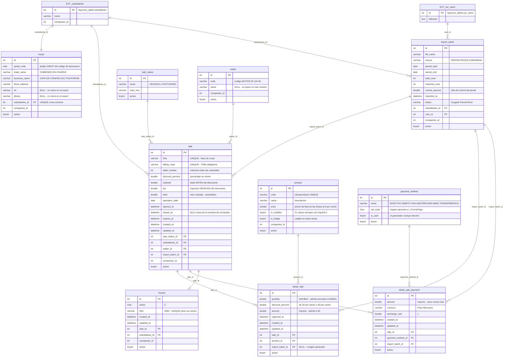

# Facturador SAT — Plan de implementación y diagrama ER

> **Versión 2 — reconstruida desde los exports reales.**
> Fuente de verdad: los dos archivos que viven en esta misma carpeta.
>
> - `docs/Reporte_De_Ventas_20260709.xlsx` — export del portal de auto-facturación (3 hojas)
> - `docs/comandas.xls` — export del POS de restaurante (BIFF/OLE2, 1 hoja, 13 141 filas)
>
> La versión anterior de este documento se modeló desde el template HTML y desde
> `Sistema Factura SAT.xlsx`. Los exports reales desmintieron una parte importante de aquel modelo:
> el §9 lista las correcciones una por una.
>
> Se conserva lo que sigue siendo válido: la inspección del servidor vía MCP MySQL, el conflicto de
> collation entre grimorios, la regla de no duplicar `subsidiaries` / `usr_users`, y la auditoría del
> diagrama ER dibujado por el usuario — ahora contrastada contra datos medidos.

---

## 1. Resumen ejecutivo

Los dos archivos son **dos ventanas del mismo negocio**, no dos negocios:

| | Reporte de ventas | comandas |
|---|---|---|
| Origen | portal de auto-facturación | POS de restaurante |
| Grano | 1 fila = 1 cuenta (ticket) | 1 fila = 1 partida de la cuenta |
| Filas | 3 821 ventas + 3 909 pagos | 13 141 partidas / 1 802 cuentas |
| Ventana | 2026-06-01 07:39:01 → 2026-06-30 23:28:19 (mes completo) | 2026-06-01 07:39:01 → 2026-06-15 23:26:19 (primera quincena) |
| Aporta | dinero, impuestos, estado fiscal, pagos | qué se consumió, mesa, mesero, tiempos |

**La llave es `comandas.foliocuenta` = `Reporte de ventas.Folio`.** Intersección **1 802 de 1 802**: cero
huérfanos del lado comandas. Los 2 019 folios de ventas sin comandas son la segunda quincena, que
sencillamente no viene en el export del POS.

Tres cifras que definen el módulo:

- **Solo el 6.7 % de los tickets se facturó** (256 `FACTURADO` contra 3 565 `VENCIDO`). El resto caducó sin
  que nadie pidiera factura. Ese es el problema de negocio.
- **La suma de `Total` es 2 644 933.30**, idéntica al pivote de la hoja "Ventas realizadas". El export cuadra
  consigo mismo al centavo.
- **La suma de los pagos es igual al `Total` de la venta en 3 821 de 3 821 tickets.** Integridad perfecta.

---

## 2. Anatomía de las fuentes

### 2.1 `Reporte_De_Ventas_20260709.xlsx`

Tres hojas. Las dos primeras comparten un **membrete de 6 filas** que hay que saltar:

```
fila 1  COMIENDO EN CHIAPAS                        ← razón comercial
fila 2  CAFE DE CHIAPAS SUC. POLIFORUM             ← sucursal emisora
fila 3  CALLE BRASIL, NUM 572, COL. EL RETIRO …    ← domicilio
fila 4  (vacía)
fila 5  Reporte de ventas   /   Pagos              ← título de la hoja
fila 6  2026/06/01 Al 2026/07/01                   ← rango del reporte
fila 7  ENCABEZADO DE COLUMNAS                     ← aquí está el header real
fila 8  primer renglón de datos
```

> ⚠️ **El encabezado está en la fila 7, no en la 8.** Los datos arrancan en la fila 8. Si el importador
> asume header en 8 se pierde la primera venta (folio `174443`, $36.00) y el conteo baja de **3 821 a 3 820**.
> El mismo desfase afecta a la hoja Pagos (**3 909**, no 3 908).

#### Hoja "Reporte de ventas" — 3 821 filas, 10 columnas

| # | Columna | Tipo observado | Nulos | Cardinalidad / rango | Rarezas medidas |
|---|---|---|---|---|---|
| 0 | `Folio` | `str`, máx 6 | 0 | 3 821 únicos · 170617–174442 | Es la llave de cruce. Numérico pero llega como texto |
| 1 | `Código facturación` | `str`, 14 tras `TRIM` | 0 | 3 821 únicos | **CHAR con relleno**: 3 661 vienen a 14 chars y 160 a 30 (los mismos 14 + espacios). Prefijo `156537` constante en 3 821/3 821 |
| 2 | `Fecha` | `datetime` | 0 | 2026-06-01 07:39 → 2026-06-30 23:28 | **Coincide con `comandas.fechaapertura` en 1 802 de 1 802.** Es la apertura de la cuenta, no el cierre (solo 28 coinciden con el cierre) |
| 3 | `Descuento` | `int` | 0 | 0 (3 676) · 30 (90) · 100 (46) · 15 (9) | Es **porcentaje**, no monto |
| 4 | `Subtotal` | `float`/`int` | 0 | — | Base gravable **antes** del descuento (§3.1) |
| 5 | `Impuestos` | `float`/`int` | 0 | — | Impuesto calculado sobre el total **ya descontado** (§3.1) |
| 6 | `Total` | `int`/`float` | 0 | suma = 2 644 933.30 | Neto cobrado. Cuadra con los pagos al 100 % |
| 7 | `Fecha de expiración` | `datetime` | 0 | 2026-06-30 (3 815) · 2026-07-01 (6) | Es **fin de mes** a las `23:59:59` (6 excepciones a las `23:00:00`) |
| 8 | `Estado` | `str`, máx 9 | 0 | **2 valores**: `VENCIDO` 3 565 · `FACTURADO` 256 | — |
| 9 | `Folio factura` | `str`, máx 5 | 3 565 vacíos | 256 únicos | Serie `C`, consecutivos **2229–2505 con 21 huecos**. Correlación perfecta: `FACTURADO` ⇔ folio lleno, `VENCIDO` ⇔ vacío (3 565/3 565 y 256/256) |

**La tasa de impuesto NO es fija por ticket.** Tasa implícita (`Impuestos / Subtotal`):

| 16 % | 11 % | 0 % | 15 % | 14 % | 13 % | 12 % | 8 % |
|---|---|---|---|---|---|---|---|
| 3 573 | 92 | 63 | 41 | 29 | 11 | 4 | 3 |

Son **tickets mixtos**: productos gravados y exentos en la misma cuenta, así que la tasa que se ve es una
tasa mezclada. Y `comandas` **no trae ninguna columna de impuesto**. Conclusión de modelado, firme: el
impuesto solo puede vivir **a nivel de cuenta y tal como llega**. No se puede repartir por partida ni
recalcular con una tasa.

#### Hoja "Pagos" — 3 909 filas, 8 columnas

| # | Columna | Tipo | Cardinalidad | Nota |
|---|---|---|---|---|
| 0 | `Folio` | `str`, máx 6 | 3 821 folios | 0 folios que no existan en ventas · 0 ventas sin pago |
| 1 | `Método de pago` | `str`, máx 16 | **6 valores** | `EFECTIVO` 1 881 · `DEBITO` 1 233 · `VISA` 678 · `MASTERCARD` 78 · `AMERICAN EXPRESS` 36 · `TRANSFERENCIA` 3 |
| 2 | `Moneda` | `str`, máx 13 | **1 valor** | `Peso Mexicano` en 3 909/3 909 |
| 3 | `Importe` | `int`/`float` | — | **El único monto real del pago** |
| 4 | `Tipo de cambio` | `int` | **1 valor** | `1` en 3 909/3 909 |
| 5 | `Subtotal` | `float`/`int` | — | ⚠️ **es del ticket, no del pago** |
| 6 | `Impuestos` | `float`/`int` | — | ⚠️ **es del ticket, no del pago** |
| 7 | `Total` | `int`/`float` | — | ⚠️ **idéntico a `Importe` en 3 909 de 3 909** |

**Distribución de pagos por venta:** 1 pago → 3 740 · 2 pagos → 74 · 3 pagos → 7. Máximo 3.

> ⚠️ **La trampa de la hoja Pagos.** En los 81 tickets multipago, `Subtotal` e `Impuestos` **se repiten
> idénticos en cada fila** (verificado: 81 de 81). Sumar esas columnas duplica o triplica dinero. Solo
> `Importe` es del pago. Y `Total` es una copia literal de `Importe` (3 909/3 909), así que **las tres
> columnas se descartan** al importar.

#### Hoja "Ventas realizadas"

No es una tabla: es un pivote de 4 filas (`2026 · jun · 2 644 933.30`). Su valor es **exactamente** la suma
de la columna `Total` de la hoja de ventas — diferencia `0.00`. Se usa como **cifra de control** del
importador, no se persiste.

### 2.2 `comandas.xls`

Formato BIFF real (OLE2): requiere `xlrd`, `openpyxl` no lo abre. Header en la **fila 1**, datos desde la 2.
13 141 filas, 12 columnas, **1 802 cuentas distintas**.

| # | Columna | Tipo | Máx | Rarezas medidas |
|---|---|---|---|---|
| 0 | `foliocomanda` | `str` | 4 | **Vacío en 13 138 de 13 141.** Columna muerta |
| 1 | `foliocuenta` | `str` | 6 | 1 802 únicos. **La llave de cruce** |
| 2 | `orden` | `str` | 2 | Es el **número de mesa** (12, 19, 10, 14, 28, 33, 37…), no un consecutivo |
| 3 | `fechaapertura` | `float` | — | **Serial Excel** (46174.3267…). Conversión: `1899-12-30 + días` |
| 4 | `fechacierre` | `float` | — | Serial Excel. **0 cuentas cruzan la medianoche** |
| 5 | `mesero` | `str` | 3 | **Código**, no nombre: `'03'`, `'124'`, `'46'`… 18 distintos, uno vacío |
| 6 | `claveproducto` | `str` | 7 | 376 claves |
| 7 | `fechadecaptura` | `float` | — | Serial Excel. 57 filas caen fuera de `[apertura, cierre]` |
| 8 | `descripcion` | `str` | 37 | 372 descripciones · **0 claves con más de una descripción** |
| 9 | `cantidad` | `float` | — | 1.0 (11 987) · 2.0 (763) · **0.096061 (170)** · 3.0 (114) · **0.5 (48)** · 4.0 (22) |
| 10 | `descuento` | `str` | 4 | **Texto con símbolo**: `'0%'` 13 070 · `'20%'` 37 · `'30%'` 32 · `'100%'` 2 |
| 11 | `importe` | `float` | — | **0.00 en 1 465 filas (11.1 %)** |

**Los campos de cabecera son 100 % consistentes dentro de la cuenta.** Verificado sobre las 1 802 cuentas:
`fechaapertura`, `fechacierre`, `mesero` y `orden` tienen **0 inconsistencias**. Esto valida sin discusión
la separación `sale` (cabecera) / `detail_sale` (partidas).

**No hay llave natural de partida.** 1 578 pares `(cuenta, clave)` aparecen en más de un renglón, con hasta
**13 repeticiones** del mismo producto en la misma cuenta. Es normal en restaurante (cada comanda es su
propio renglón), pero obliga a que la reimportación borre y reinserte en vez de hacer `UPSERT` por línea.

---

## 3. Las tres rarezas, resueltas

El perfilado inicial dejó tres cosas marcadas como "inconsistencia del origen". **Ninguna lo es.** Las tres
tienen una regla exacta, verificada contra los 3 821 tickets.

### 3.1 `Subtotal + Impuestos ≠ Total` en 145 tickets — resuelto

No es ruido: es **sistemático y perfectamente separable**.

| | Cuadra `Sub+Imp = Total` | No cuadra |
|---|---|---|
| `Descuento = 0` (3 676 tickets) | **3 676** | 0 |
| `Descuento > 0` (145 tickets) | 0 | **145** |

Los 145 que no cuadran son **exactamente** los 145 que traen descuento. La razón es que las tres columnas
están medidas sobre **bases distintas**:

```
Subtotal   = bruto / (1 + tasa)          ← base gravable ANTES del descuento
Impuestos  = Total × tasa / (1 + tasa)   ← impuesto DESPUÉS del descuento
Total      = bruto × (1 − Descuento/100) ← lo efectivamente cobrado
```

Verificado sobre los 145: los 99 con descuento de 15 % o 30 % cumplen
`Total = Subtotal × (1+t) × (1−d/100)` con `t = Impuestos/(Total−Impuestos)`; los 46 con descuento del 100 %
tienen `Total = 0` y lo cumplen trivialmente. **145 de 145.**

Ejemplo (folio `170685`): bruto de comandas 120.00 · `Descuento` 30 · `Subtotal` 103.4483 = 120/1.16 ·
`Total` 84.00 = 120 × 0.70 · `Impuestos` 11.5862 = 84 × 0.16/1.16. Todo encaja.

> **Consecuencia de modelado:** `subtotal`, `tax` y `total` se guardan **tal como llegan**. El sistema no los
> recalcula ni intenta forzar `subtotal + tax = total`, porque en los tickets con descuento esa igualdad es
> falsa por diseño del origen.

### 3.2 Los dos mecanismos de descuento — resuelto

Hay **dos** formas de descontar en el origen, y son **mutuamente excluyentes**:

| | Mecanismo A — descuento de cuenta | Mecanismo B — descuento de partida |
|---|---|---|
| Dónde vive | `Descuento` de la cabecera (%) | `descuento` de la línea (`'20%'`, `'30%'`) |
| Estado del otro campo | líneas siempre en `'0%'` | cabecera siempre en `0` |
| `importe` de la línea | **bruto** (sin descontar) | **ya neto** (descontado) |
| Fórmula del total | `Total = Σ importe × (1 − d/100)` | `Total = Σ importe` |
| Verificación | **64 de 64** | **55 de 55** |

No hay un solo caso mezclado: de los 64 tickets con descuento de cabecera, sus 89 líneas están **todas** en
`'0%'`; de las 71 líneas con descuento de partida, sus 55 cuentas tienen **todas** la cabecera en `0`.

Esto explica también el "precio ambiguo": 36 de 345 claves parecían tener dos precios unitarios, pero en
**32 de esas 36** el segundo precio es exactamente `precio_base × (1 − descuento_de_línea)`:

```
01184 HUEVOS AL GUSTO    163.00 con '0%'   ·   130.40 con '20%'   (163 × 0.80 = 130.40)
01371 HUEVOS CAMPESINOS  175.00 con '0%'   ·   140.00 con '20%'
02    LATTE               59.00 con '0%'   ·    41.30 con '30%'   ( 59 × 0.70 =  41.30)
```

> **Consecuencia:** el precio de lista de un producto **sí es único** y se obtiene tomando el
> `importe / cantidad` de las líneas con `descuento = '0%'`. Quedan 4 claves con precios que no se explican
> por descuento — probable cambio de precio a mitad de mes (pregunta abierta P4).

**La regla universal de cuadre**, verificada sobre las 1 802 cuentas cruzadas:

```
Σ(comandas.importe) × (1 − Reporte.Descuento/100)  ==  Reporte.Total
    → exacto en 1 791 de 1 802
    → dentro de $0.50 en 1 802 de 1 802   ✅
```

Los 11 que no dan exacto son los del §3.3 y difieren **$0.20** por redondeo.

### 3.3 `cantidad = 0.096061` (170 filas) — resuelto

No es un bug ni granel: es un **prorrateo de cuenta compartida**.

Las 170 filas se concentran en **solo 10 cuentas de folios consecutivos** (`170945`, `170948`–`170954`…), y
las 10 son **idénticas**: las mismas 17 partidas, con la misma cantidad `0.096061` cada una, los mismos
importes, y bruto `500.20` en todas.

```
cuenta 170945 (17 partidas, todas con cantidad 0.096061):
   01093  PLATON CHIAPANECO           × 6 renglones   importe 64.8675  → precio 675.27
   02119  JARRA DE LIMONADA 2 LT.     × 4 renglones   importe 10.5710  → precio 110.04
   02120  JARRA DE NARANJADA 2 LT.    × 5 renglones   importe 10.5710  → precio 110.04
   02000  CAFE DESCAFEINADO 240ML     × 1 renglón     importe  6.2465  → precio  65.03
   01282  EXTRA DESCORCHE PASTEL      × 1 renglón     importe  9.6100  → precio 100.04
   suma de cantidades = 1.633037
```

El precio unitario implícito (`importe / cantidad`) da valores **redondos y creíbles**: 110.04, 675.27,
65.03, 100.04. Es decir, el POS tomó un consumo de evento y lo **repartió entre 10 cuentas** aplicando el
factor `0.096061 ≈ 1/10.41` a cada partida.

> **Consecuencia de modelado:** `quantity` es **`DOUBLE`, nunca `INT`**, y el cuadre del importador debe
> aceptar una tolerancia de centavos: el prorrateo produce `500.20` contra un `Total` de `500.00`
> (0.04 % de diferencia). Son exactamente los 11 folios que no dan exacto en §3.2.

### 3.4 `importe = 0.00` en 1 465 filas (11 %) — explicado

Dos poblaciones distintas, y se distinguen por un criterio medible:

- **31 claves aparecen SIEMPRE con importe 0** → son **modificadores puros**. Se ven en los datos:
  `BIEN COCIDO` (276), `1/2` (101), `3/4` (100), `TIERNO` (63), `N/A` (62), `SALSA VERDE`, `POLLO`, y los
  componentes de paquete de desayuno: `CAFE AMERICANO DESAYUNO` (159), `JUGO DESAYUNO VERDE` (106),
  `FRUTA DESAYUNO` (55), `AGUA MENU DEL DIA COMIDA`, `GUISO DEL DIA`.
- **58 líneas con importe 0 cuyo producto SÍ cobra en otras cuentas** → son **cortesías**:
  `EXTRA JAMON` (19), `R-AGUA MINERAL` (13), `EXTRA CHORIZO` (10), `EXTRA TOCINO 3 PZAS.` (8).

> **Consecuencia:** `product.is_modifier` se puede **poblar automáticamente** en el import
> (`claves que nunca tienen importe > 0`), y `detail_sale.amount = 0` es un valor legítimo que no rompe el
> cuadre.

---

## 4. Mapeo columna por columna

### 4.1 `Reporte de ventas` → esquema

| Columna del Excel | Destino | Transformación |
|---|---|---|
| `Folio` | `sale.folio` | `TRIM`. `UNIQUE`. Llave de cruce con comandas |
| `Código facturación` | `sale.billing_code` | **`TRIM` obligatorio** (160 vienen con relleno a 30). `UNIQUE` |
| `Código facturación` (prefijo) | `issuer.portal_code` | Primeros 6 chars (`156537`), constante → se alza al emisor, no se repite por venta |
| `Fecha` | `sale.opened_at` + `sale.operation_date` | `DATETIME` completo + su `DATE` para filtrar por día |
| `Descuento` | `sale.discount_percent` | `DOUBLE`. **Porcentaje**, no monto |
| `Subtotal` | `sale.subtotal` | Tal cual. Base **pre**-descuento (§3.1) |
| `Impuestos` | `sale.tax` | Tal cual. Impuesto **post**-descuento (§3.1) |
| `Total` | `sale.total` | Tal cual. Es la cifra autoritativa |
| `Fecha de expiración` | `sale.expires_at` | `DATETIME` |
| `Estado` | `sale.sale_status_id` | Resolver contra catálogo `sale_status` (`VENCIDO`, `FACTURADO`) |
| `Folio factura` | `invoice.series` + `invoice.folio` | Partir `C2482` → serie `C` + folio `2482`. Solo si no está vacío |

### 4.2 `Pagos` → esquema

| Columna del Excel | Destino | Transformación |
|---|---|---|
| `Folio` | `detail_sale_payment.sale_id` | Resolver contra `sale.folio` |
| `Método de pago` | `detail_sale_payment.payment_method_id` | Resolver/crear en catálogo `payment_method` |
| `Moneda` | `detail_sale_payment.currency` | Se conserva (hoy 1 valor, ver decisión D3) |
| `Importe` | `detail_sale_payment.amount` | **El único monto real del renglón** |
| `Tipo de cambio` | `detail_sale_payment.exchange_rate` | Se conserva (hoy siempre 1, ver D3) |
| `Subtotal` | ❌ **descartada** | Es del ticket y se repite en multipago (81/81) → duplicaría dinero |
| `Impuestos` | ❌ **descartada** | Idem |
| `Total` | ❌ **descartada** | Copia literal de `Importe` en 3 909/3 909 |

### 4.3 `comandas` → esquema

| Columna del Excel | Destino | Transformación |
|---|---|---|
| `foliocomanda` | ❌ **descartada** | Vacía en 13 138 de 13 141 (99.98 %) |
| `foliocuenta` | `detail_sale.sale_id` | Resolver contra `sale.folio` |
| `orden` | `sale.table_number` | Es la **mesa**. `INT`. Va a la cabecera (consistente en 1 802/1 802) |
| `fechaapertura` | — (validación) | Serial → `DATETIME`. Coincide con `Reporte.Fecha` en 1 802/1 802: se usa para **validar**, no se guarda dos veces |
| `fechacierre` | `sale.closed_at` | Serial → `DATETIME`. **Solo comandas lo aporta** |
| `mesero` | `sale.waiter_id` | Resolver/crear en catálogo `waiter` por `code` |
| `claveproducto` | `detail_sale.product_id` | Resolver/crear en catálogo `product` por `code` |
| `descripcion` | `product.name` | Dependencia funcional probada (0 claves con >1 descripción) |
| `fechadecaptura` | `detail_sale.captured_at` | Serial → `DATETIME` |
| `cantidad` | `detail_sale.quantity` | **`DOUBLE`** — admite `0.096061` y `0.5` (§3.3) |
| `descuento` | `detail_sale.discount_percent` | `'20%'` → `20.0`. Quitar `%`, castear |
| `importe` | `detail_sale.amount` | Tal cual. Bruto o neto según el mecanismo (§3.2) |

### 4.4 Lo que estos exports NO traen

Se documenta para que nadie lo invente: **RFC y razón social del receptor, UUID, subtotal/IVA/IEPS del CFDI,
forma y método de pago SAT, uso de CFDI, régimen fiscal, propina, comensales, terminal, IEPS**. De la
facturación, los dos archivos solo aportan `Estado` y `Folio factura`.

Por eso `invoice` nace mínima (serie + folio + enlace a la venta) y crece por `ALTER` cuando se conecte la
fuente de CFDI completa. **No se modelan columnas para datos que nadie tiene todavía.**

---

## 5. Modelo de datos

**10 tablas**: 4 catálogos, 1 catálogo de tenant, 3 transacciones raíz, 2 detalles, 0 pivotes.

### 5.1 Mapa de esquemas

```
┌────────────────────────────────────────────────────────────────────────────┐
│  fayxzvov_alpha                   (maestros corporativos — NO se duplican) │
│  ┌────────────────────┐   ┌────────────────────┐                           │
│  │ subsidiaries       │   │ usr_users          │                           │
│  │ • id            PK │   │ • id            PK │                           │
│  │ • name             │   │ • fullname         │                           │
│  │ • companies_id     │   │ • subsidiaries_id  │                           │
│  └─────────┬──────────┘   └─────────┬──────────┘                           │
└────────────┼────────────────────────┼──────────────────────────────────────┘
             │ subsidiaries_id        │ user_id
             ▼                        ▼
╔════════════════════════════════════════════════════════════════════════════╗
║  fayxzvov_facturacion                         [ESQUEMA NUEVO — 10 tablas]  ║
║                                                                            ║
║   Catálogos              Tenant            Raíces           Detalles       ║
║   ─────────────          ──────────        ─────────        ─────────      ║
║   sale_status            issuer            import_batch     detail_sale    ║
║   payment_method                           sale             detail_sale_…  ║
║   waiter                                   invoice                         ║
║   product                                                                  ║
╚════════════════════════════════════════════════════════════════════════════╝
```

### 5.2 Diagrama ER



### 5.3 Cardinalidades

| Origen | → | Destino | Cardinalidad | Evidencia medida |
|---|---|---|---|---|
| sale | → | detail_sale | 1 : N | 13 141 partidas / 1 802 cuentas ≈ 7.3 por cuenta |
| sale | → | detail_sale_payment | 1 : N | 3 740 con 1 pago · 74 con 2 · 7 con 3 |
| sale | → | invoice | 1 : 0..1 | 256 de 3 821 tickets (6.7 %) |
| sale | → | sale_status | N : 1 | 2 valores |
| sale | → | waiter | N : 1 | 18 códigos |
| sale | → | subsidiaries | N : 1 | **cross-schema** |
| detail_sale | → | product | N : 1 | 376 claves |
| detail_sale_payment | → | payment_method | N : 1 | 6 métodos |
| sale / detail_* | → | import_batch | N : 1 | trazabilidad de la carga |
| issuer | → | subsidiaries | 1 : 1 | **cross-schema**, `UNIQUE(subsidiaries_id)` |

---

## 6. Estructura de tablas

### 6.1 Catálogos

```
┌──────────────────────────────────────────────────────────────────────┐
│ sale_status  (catálogo — estado fiscal del ticket)                   │
├──────────────────────────────────────────────────────────────────────┤
│  id                     INT PK                                       │
│                                                                      │
│  ── Negocio ──                                                       │
│  name                   VARCHAR(20)     VENCIDO / FACTURADO          │
│  color_hex              VARCHAR(7)      color del badge              │
│                                                                      │
│  ── Timestamps ──                                                    │
│  created_at             DATETIME                                     │
│  updated_at             DATETIME                                     │
│                                                                      │
│  ── Soft-delete ──                                                   │
│  active                 TINYINT                                      │
└──────────────────────────────────────────────────────────────────────┘

┌──────────────────────────────────────────────────────────────────────┐
│ payment_method  (catálogo — método de pago del POS)                  │
├──────────────────────────────────────────────────────────────────────┤
│  id                     INT PK                                       │
│                                                                      │
│  ── Negocio ──                                                       │
│  name                   VARCHAR(30)     EFECTIVO, DEBITO, VISA …     │
│  sat_code               CHAR(2)         NULL — mapeo a c_FormaPago   │
│  is_cash                TINYINT         1 en EFECTIVO                │
│                                                                      │
│  ── Timestamps ──                                                    │
│  created_at             DATETIME                                     │
│  updated_at             DATETIME                                     │
│                                                                      │
│  ── Soft-delete ──                                                   │
│  active                 TINYINT                                      │
│                                                                      │
│  ── Índices ──                                                       │
│  UNIQUE KEY (name)                      dedupe en el import          │
└──────────────────────────────────────────────────────────────────────┘

┌──────────────────────────────────────────────────────────────────────┐
│ waiter  (catálogo — mesero del POS)                                  │
├──────────────────────────────────────────────────────────────────────┤
│  id                     INT PK                                       │
│                                                                      │
│  ── Negocio ──                                                       │
│  code                   VARCHAR(5)      '03', '124', '46' …          │
│  name                   VARCHAR(150)    NULL — se captura a mano     │
│                                                                      │
│  ── Timestamps ──                                                    │
│  created_at             DATETIME                                     │
│  updated_at             DATETIME                                     │
│                                                                      │
│  ── FK cross-schema ──                                               │
│  companies_id           INT             sin CONSTRAINT (ver D2)      │
│                                                                      │
│  ── Soft-delete ──                                                   │
│  active                 TINYINT                                      │
│                                                                      │
│  ── Índices ──                                                       │
│  UNIQUE KEY (code, companies_id)                                     │
└──────────────────────────────────────────────────────────────────────┘

┌──────────────────────────────────────────────────────────────────────┐
│ product  (catálogo — platillos, modificadores y puentes)             │
├──────────────────────────────────────────────────────────────────────┤
│  id                     INT PK                                       │
│                                                                      │
│  ── Negocio ──                                                       │
│  code                   VARCHAR(10)     claveproducto (máx 7 real)   │
│  name                   VARCHAR(60)     descripcion (máx 37 real)    │
│  is_modifier            TINYINT         1 si nunca cobra (31 claves) │
│  is_bridge              TINYINT         1 si sirve al ticket virtual │
│                                                                      │
│  ── Montos ──                                                        │
│  price                  DOUBLE          de las líneas con desc 0%    │
│                                                                      │
│  ── Timestamps ──                                                    │
│  created_at             DATETIME                                     │
│  updated_at             DATETIME                                     │
│                                                                      │
│  ── FK cross-schema ──                                               │
│  companies_id           INT             sin CONSTRAINT (ver D2)      │
│                                                                      │
│  ── Soft-delete ──                                                   │
│  active                 TINYINT                                      │
│                                                                      │
│  ── Índices ──                                                       │
│  UNIQUE KEY (code, companies_id)        resolución en el import      │
└──────────────────────────────────────────────────────────────────────┘
```

### 6.2 Catálogo del tenant

```
┌──────────────────────────────────────────────────────────────────────┐
│ issuer  (catálogo — emisor; el `branch` del diagrama del usuario)    │
├──────────────────────────────────────────────────────────────────────┤
│  id                     INT PK                                       │
│                                                                      │
│  ── Negocio ──                                                       │
│  portal_code            CHAR(6)         '156537' — prefijo del código│
│  trade_name             VARCHAR(150)    COMIENDO EN CHIAPAS          │
│  business_name          VARCHAR(255)    CAFE DE CHIAPAS SUC. POLIF.  │
│  fiscal_address         VARCHAR(255)    CALLE BRASIL, NUM 572 …      │
│  rfc                    VARCHAR(13)     NULL — no viene en el export │
│  phone                  VARCHAR(20)     NULL — no viene en el export │
│  issuing_place          VARCHAR(10)     NULL — CP, para CFDI futuro  │
│                                                                      │
│  ── Timestamps ──                                                    │
│  created_at             DATETIME                                     │
│  updated_at             DATETIME                                     │
│                                                                      │
│  ── FK cross-schema ──                                               │
│  subsidiaries_id        → fayxzvov_alpha.subsidiaries  (UNIQUE)      │
│  companies_id           INT             sin CONSTRAINT (ver D2)      │
│                                                                      │
│  ── Soft-delete ──                                                   │
│  active                 TINYINT                                      │
└──────────────────────────────────────────────────────────────────────┘
```

### 6.3 Transacciones raíz

```
┌──────────────────────────────────────────────────────────────────────┐
│ import_batch  (raíz — una carga de archivo)                          │
├──────────────────────────────────────────────────────────────────────┤
│  id                     INT PK                                       │
│                                                                      │
│  ── Negocio ──                                                       │
│  file_name              VARCHAR(255)    comandas.xls                 │
│  source                 VARCHAR(20)     VENTAS/PAGOS/COMANDAS        │
│  total_rows             INT             3821 · 3909 · 13141          │
│  matched_rows           INT             filas que cruzaron con éxito │
│                                                                      │
│  ── Montos ──                                                        │
│  control_amount         DOUBLE          2644933.30 (pivote)          │
│                                                                      │
│  ── Timestamps ──                                                    │
│  period_start           DATE            del membrete fila 6          │
│  period_end             DATE            del membrete fila 6          │
│  imported_at            DATETIME                                     │
│  created_at             DATETIME                                     │
│  updated_at             DATETIME                                     │
│                                                                      │
│  ── Status ──                                                        │
│  status                 VARCHAR(20)     Cargado/Parcial/Error        │
│                                                                      │
│  ── FK cross-schema ──                                               │
│  subsidiaries_id        → fayxzvov_alpha.subsidiaries   SET NULL     │
│  user_id                → fayxzvov_alpha.usr_users      SET NULL     │
│  companies_id           INT             sin CONSTRAINT (ver D2)      │
│                                                                      │
│  ── Soft-delete ──                                                   │
│  active                 TINYINT                                      │
│                                                                      │
│  ── Índices ──                                                       │
│  KEY (source, period_start, period_end)  detecta reimportación       │
└──────────────────────────────────────────────────────────────────────┘

┌──────────────────────────────────────────────────────────────────────┐
│ sale  (raíz — la cuenta / ticket)                                    │
├──────────────────────────────────────────────────────────────────────┤
│  id                     INT PK                                       │
│                                                                      │
│  ── Negocio ──                                                       │
│  folio                  VARCHAR(10)     Folio = foliocuenta          │
│  billing_code           VARCHAR(14)     Código facturación (TRIM)    │
│  table_number           INT             columna `orden` de comandas  │
│                                                                      │
│  ── Montos ──                                                        │
│  discount_percent       DOUBLE          0 / 15 / 30 / 100            │
│  subtotal               DOUBLE          base ANTES del descuento     │
│  tax                    DOUBLE          impuesto DESPUÉS del desc.   │
│  total                  DOUBLE          neto cobrado (autoritativo)  │
│                                                                      │
│  ── Timestamps ──                                                    │
│  operation_date         DATE            DATE(Fecha)                  │
│  opened_at              DATETIME        Fecha = fechaapertura        │
│  closed_at              DATETIME        NULL fuera de la ventana     │
│  expires_at             DATETIME        Fecha de expiración          │
│  created_at             DATETIME                                     │
│  updated_at             DATETIME                                     │
│                                                                      │
│  ── Status ──                                                        │
│  sale_status_id         → sale_status         SET NULL               │
│                                                                      │
│  ── FK cross-schema ──                                               │
│  subsidiaries_id        → fayxzvov_alpha.subsidiaries   SET NULL     │
│  companies_id           INT             sin CONSTRAINT (ver D2)      │
│                                                                      │
│  ── FK locales ──                                                    │
│  waiter_id              → waiter              SET NULL               │
│  import_batch_id        → import_batch        SET NULL               │
│                                                                      │
│  ── Soft-delete ──                                                   │
│  active                 TINYINT                                      │
│                                                                      │
│  ── Índices ──                                                       │
│  UNIQUE KEY (folio, companies_id)       llave natural del POS        │
│  UNIQUE KEY (billing_code)              3821/3821 únicos             │
│  KEY (operation_date)                   filtro del tablero diario    │
│  KEY (sale_status_id)                   VENCIDO vs FACTURADO         │
└──────────────────────────────────────────────────────────────────────┘

┌──────────────────────────────────────────────────────────────────────┐
│ invoice  (raíz — CFDI emitido; mínima por ahora)                     │
├──────────────────────────────────────────────────────────────────────┤
│  id                     INT PK                                       │
│                                                                      │
│  ── Negocio ──                                                       │
│  series                 CHAR(2)         'C'                          │
│  folio                  VARCHAR(10)     '2482' … '2505'              │
│                                                                      │
│  ── Timestamps ──                                                    │
│  created_at             DATETIME                                     │
│  updated_at             DATETIME                                     │
│                                                                      │
│  ── FK cross-schema ──                                               │
│  subsidiaries_id        → fayxzvov_alpha.subsidiaries   SET NULL     │
│  companies_id           INT             sin CONSTRAINT (ver D2)      │
│                                                                      │
│  ── FK locales ──                                                    │
│  sale_id                → sale                SET NULL               │
│                                                                      │
│  ── Soft-delete ──                                                   │
│  active                 TINYINT                                      │
│                                                                      │
│  ── Índices ──                                                       │
│  UNIQUE KEY (series, folio, companies_id)                            │
└──────────────────────────────────────────────────────────────────────┘
```

> `invoice.sale_id` va `SET NULL` y no `CASCADE`: un CFDI timbrado no puede desaparecer porque se borre el
> ticket. `invoice` no es detalle de `sale`, es otra raíz que la referencia.

### 6.4 Detalles

```
┌──────────────────────────────────────────────────────────────────────┐
│ detail_sale  (detalle — partida de la cuenta)                        │
├──────────────────────────────────────────────────────────────────────┤
│  id                     INT PK                                       │
│                                                                      │
│  ── Montos ──                                                        │
│  quantity               DOUBLE          admite 0.096061 y 0.5        │
│  discount_percent       DOUBLE          '20%' → 20.0                 │
│  amount                 DOUBLE          importe; 0.00 es válido      │
│                                                                      │
│  ── Timestamps ──                                                    │
│  captured_at            DATETIME        fechadecaptura               │
│  created_at             DATETIME                                     │
│  updated_at             DATETIME                                     │
│                                                                      │
│  ── FK locales ──                                                    │
│  sale_id                → sale                CASCADE                │
│  product_id             → product             SET NULL               │
│  import_batch_id        → import_batch        SET NULL               │
│                                         NULL = renglón generado      │
│                                                                      │
│  ── Soft-delete ──                                                   │
│  active                 TINYINT                                      │
│                                                                      │
│  ── Índices ──                                                       │
│  KEY (sale_id, product_id)              NO es UNIQUE: hasta 13 veces │
└──────────────────────────────────────────────────────────────────────┘

┌──────────────────────────────────────────────────────────────────────┐
│ detail_sale_payment  (detalle — pago aplicado a la cuenta)           │
├──────────────────────────────────────────────────────────────────────┤
│  id                     INT PK                                       │
│                                                                      │
│  ── Negocio ──                                                       │
│  currency               VARCHAR(30)     'Peso Mexicano'              │
│                                                                      │
│  ── Montos ──                                                        │
│  amount                 DOUBLE          Importe (único monto real)   │
│  exchange_rate          DOUBLE          Tipo de cambio (hoy 1)       │
│                                                                      │
│  ── Timestamps ──                                                    │
│  created_at             DATETIME                                     │
│  updated_at             DATETIME                                     │
│                                                                      │
│  ── FK locales ──                                                    │
│  sale_id                → sale                CASCADE                │
│  payment_method_id      → payment_method      SET NULL               │
│  import_batch_id        → import_batch        SET NULL               │
│                                                                      │
│  ── Soft-delete ──                                                   │
│  active                 TINYINT                                      │
│                                                                      │
│  ── Índices ──                                                       │
│  KEY (sale_id)                          hasta 3 pagos por venta      │
└──────────────────────────────────────────────────────────────────────┘
```

---

## 7. Proceso de importación

### 7.1 Orden obligatorio

```
1) VENTAS    (Reporte_De_Ventas.xlsx · hoja "Reporte de ventas")   → crea `sale` + `invoice`
2) PAGOS     (Reporte_De_Ventas.xlsx · hoja "Pagos")               → crea `detail_sale_payment`
3) COMANDAS  (comandas.xls)                                        → crea `detail_sale` + enriquece `sale`
```

`sale` es prerrequisito de los otros dos: sin la venta no hay a qué colgar el pago ni la partida. Si el
usuario sube comandas primero, el importador **rechaza el archivo** con un mensaje claro en vez de crear
ventas fantasma.

### 7.2 Lectura de cada archivo

| | VENTAS / PAGOS | COMANDAS |
|---|---|---|
| Librería | `openpyxl` | **`xlrd`** (es BIFF/OLE2, `openpyxl` no lo abre) |
| Header | **fila 7** | fila 1 |
| Datos | desde la **fila 8** | desde la fila 2 |
| Periodo | de la fila 6 (`2026/06/01 Al 2026/07/01`) | del `min`/`max` de `fechaapertura` |
| Fechas | ya vienen `datetime` | **serial Excel** → `1899-12-30 + días` |

Normalizaciones obligatorias al leer:

- `TRIM` en `Código facturación` (160 filas traen relleno a 30 chars).
- `'20%'` → `20.0` en `comandas.descuento`.
- `cantidad` e `importe` → `DOUBLE`, nunca `INT`.
- Descartar `Subtotal`, `Impuestos` y `Total` de la hoja Pagos.
- Descartar `foliocomanda`.

### 7.3 Idempotencia y reimportación

El problema real: **las ventanas se traslapan**. Ventas cubre todo junio, comandas solo del 1 al 15. Volver
a subir comandas no debe tocar las ventas del 16 al 30.

**Regla: el alcance del borrado se define por los folios presentes en el archivo, nunca por el rango de
fechas.**

```
1. Leer el archivo completo en memoria y extraer el conjunto de folios F.
2. Abrir un import_batch nuevo (status = 'Parcial').
3. Según la fuente:
   VENTAS    → UPSERT por (folio, companies_id). El folio y el billing_code son UNIQUE,
               así que reimportar actualiza montos y estado, no duplica.
   PAGOS     → soft-delete (active = 0) de todos los detail_sale_payment cuyo sale_id
               esté en F, y reinsertar. No hay llave natural de renglón de pago.
   COMANDAS  → soft-delete de todos los detail_sale cuyo sale_id esté en F
               Y que tengan import_batch_id IS NOT NULL.
               ⚠️ Los renglones generados (import_batch_id NULL) NO se tocan.
4. Marcar el batch anterior de la misma fuente y periodo como active = 0.
5. Cerrar el batch: status = 'Cargado', matched_rows, control_amount.
```

Ese `AND import_batch_id IS NOT NULL` del paso 3 es lo que impide que reimportar comandas destruya los
tickets virtuales que el usuario ya generó.

### 7.4 Validaciones y cifras de control

Al cerrar cada batch se calcula y se guarda:

| Fuente | Validación | Valor esperado en estos archivos |
|---|---|---|
| VENTAS | `Σ Total` contra el pivote de "Ventas realizadas" | `2 644 933.30`, diferencia `0.00` |
| VENTAS | folios únicos == filas leídas | 3 821 == 3 821 |
| VENTAS | `Estado = FACTURADO` ⇔ `Folio factura` no vacío | 256 y 3 565, sin excepciones |
| PAGOS | folios de pagos ⊆ folios de ventas | 0 huérfanos |
| PAGOS | `Σ Importe` por folio == `sale.total` | 3 821 de 3 821 |
| COMANDAS | `foliocuenta` ⊆ `sale.folio` | 1 802 de 1 802 |
| COMANDAS | `Σ importe × (1 − descuento/100)` == `sale.total` | 1 791 exacto · **1 802 con tolerancia de $0.50** |

### 7.5 Qué hacer con lo que no cuadra

**No se rechaza: se marca y se reporta.** Los desajustes conocidos son legítimos:

- Los **11 folios prorrateados** (§3.3) difieren $0.20 por redondeo. Tolerancia de $0.50 por cuenta.
- Los **2 019 folios de ventas sin comandas** no son un error: es el desfase de ventanas. `closed_at`,
  `table_number` y `waiter_id` quedan `NULL` hasta que llegue el export del POS de esa quincena.
- Las **57 capturas fuera de `[apertura, cierre]`** se importan igual; son ruido de reloj del POS.

`import_batch.matched_rows` guarda cuántas filas cruzaron; la diferencia contra `total_rows` es lo que el
usuario ve en pantalla como "N filas sin conciliar".

---

## 8. Creación de tickets

El usuario pidió explícitamente modelar esto. Con los datos reales queda anclado así:

### 8.1 Qué viene del POS y qué genera el sistema

| Campo | Origen | Nota |
|---|---|---|
| `folio`, `billing_code` | **POS / portal** | Nunca los genera el sistema: son llaves del origen |
| `subtotal`, `tax`, `total`, `discount_percent` | **POS** | Se guardan tal cual, no se recalculan (§3.1) |
| `opened_at`, `expires_at`, `sale_status_id` | **POS** | — |
| `closed_at`, `table_number`, `waiter_id` | **POS (solo comandas)** | `NULL` mientras no llegue esa quincena |
| `detail_sale` con `import_batch_id` **NOT NULL** | **POS** | Lo que el cliente consumió de verdad |
| `detail_sale` con `import_batch_id` **NULL** | **SISTEMA** | Renglones del ticket virtual generado |
| `product.is_bridge` | **usuario** | Se marca a mano en el catálogo |

### 8.2 Cómo conviven tickets importados y generados

**No hay dos tablas: hay una sola `detail_sale` con un discriminador.** `import_batch_id IS NULL` significa
"esta línea la inventó el sistema". Eso permite:

- Saber si un ticket ya fue generado: `EXISTS(detail_sale WHERE sale_id = X AND import_batch_id IS NULL)`.
  Sin columna extra.
- Reimportar comandas sin destruir lo generado (§7.3).
- Imprimir el ticket virtual mezclando o no las líneas reales, según convenga.

### 8.3 Generación del ticket virtual

Candidatos, según los datos reales:

```
sale.total > 0
  AND sale_status = 'VENCIDO'            ← lo FACTURADO queda bloqueado
  AND NOT EXISTS (pago con is_cash = 1)  ← el efectivo no se muestra (ERS)
  AND operation_date = <día elegido>
```

Algoritmo de generación:

```
1. Objetivo = sale.total.
2. Elegir al azar productos con is_bridge = 1 AND is_modifier = 0 hasta acercarse.
3. Insertar un detail_sale por producto:
      product_id, quantity, amount = quantity × product.price
      import_batch_id = NULL
4. Cuadrar el sobrante con sale.discount_percent, respetando la misma
   semántica del origen: total = bruto × (1 − d/100).
5. El botón pasa de "Generar" a "Generado".
```

Se excluyen los `is_modifier` porque tienen precio 0 y no aportan al cuadre — eso salió de los datos, no de
una suposición: son las 31 claves que nunca cobran.

**Regenerar** = `active = 0` a los renglones con `import_batch_id IS NULL` de esa venta, y volver a insertar.

---

## 9. Correcciones respecto a la versión 1 del plan

La versión anterior se modeló desde el template HTML y `Sistema Factura SAT.xlsx`. Los exports reales
desmintieron esto:

| # | La versión 1 decía | Los datos dicen | Acción |
|---|---|---|---|
| 1 | 18 tablas | Los exports solo sustentan **10** | **Eliminadas 8 tablas** |
| 2 | `order_type` y `order_subtype` (Restaurant / subtipo) | Ninguna de las dos columnas existe en estos exports | **Eliminadas** |
| 3 | `invoice_type` (Auto emisión) | No existe en estos exports | **Eliminada** |
| 4 | `payment_form` con códigos SAT (`01`, `04`) | El POS entrega **nombres**, no códigos: `EFECTIVO`, `DEBITO`, `VISA`… El mapeo al SAT no viene | **Sustituida por `payment_method` con `sat_code` NULL** |
| 5 | `payment_method` SAT (PUE/PPD) | No existe en estos exports | **Eliminada** |
| 6 | `invoice_status` (Vigente/Cancelado) | El estado real vive en la venta y tiene otros valores: `VENCIDO`/`FACTURADO` | **Sustituida por `sale_status`** |
| 7 | `customer` (RFC + razón social del receptor) | Estos exports **no traen receptor** | **Eliminada**; vuelve cuando haya fuente de CFDI |
| 8 | `product_category` + `product_group` | `comandas` no tiene columnas de grupo | **Eliminadas** |
| 9 | `sale.tip` (propina) | **No existe columna de propina** en ninguno de los dos archivos | **Eliminada** |
| 10 | `sale.guests` (comensales) | No existe | **Eliminada** |
| 11 | `sale.ieps` y `detail_sale.ieps` | No hay columna de IEPS | **Eliminadas** |
| 12 | `sale.terminal`, `detail_sale.capture_terminal` | No hay columna de terminal | **Eliminadas** |
| 13 | `sale.pos_movement` ("Movimiento PDV") | No existe | **Eliminada** |
| 14 | `pos_employee` con roles mesero **y cajero** | Los exports traen **solo mesero**, y como **código**, no nombre | **Sustituida por `waiter` con `code`** |
| 15 | `detail_sale` con subtotal/tax/costos (real, ideal, con modificadores) | `comandas` solo trae `cantidad`, `descuento` e `importe`. **Cero columnas de costo** | **Recortada a 3 montos** |
| 16 | `sale.discount` como **monto** | Es un **porcentaje** (0/15/30/100) | **Renombrada a `discount_percent`** |
| 17 | `sale.folio` = "nota del día que se reinicia" | `Folio` es un consecutivo global del POS (170617–174442), **no se reinicia** | **Corregida la semántica** |
| 18 | Tasa de impuesto derivable (`tax > 0 ? 16 : 0`) | Hay **8 tasas implícitas distintas** por tickets mixtos | **Eliminada la derivación**; el impuesto se guarda como llega |
| 19 | `import_batch.sheet_type` con 3 hojas del otro Excel | Las fuentes reales son **VENTAS / PAGOS / COMANDAS** | **Renombrada a `source` con otros valores** |

Lo que **sí sobrevivió** de la versión 1: el esquema destino `fayxzvov_facturacion`, la referencia
cross-schema a `subsidiaries` / `usr_users`, `import_batch` como raíz de trazabilidad, `issuer` para los
datos del emisor, y `import_batch_id IS NULL` como discriminador de renglón generado.

### 9.1 Auditoría del diagrama ER del usuario, revisada

El dibujo tenía 5 entidades: `branch`, `sale_status`, `sale`, `detail_sale`, `product`. Contrastado contra
los datos reales, **acertó más de lo que parecía**:

| Del dibujo | Veredicto de los datos |
|---|---|
| `sale` como entidad central | ✅ Confirmado: 3 821 cuentas |
| `detail_sale` colgando de `sale` | ✅ Confirmado: 13 141 partidas, cabecera 100 % consistente |
| `product` como catálogo con `code`, `name`, `price` | ✅ Confirmado: 376 claves, `clave → descripción` funcional |
| `sale_status` | ✅ Confirmado: existe y tiene 2 valores (`VENCIDO`/`FACTURADO`) |
| `branch` con datos fiscales | ✅ Confirmado: el membrete del export los trae (razón comercial, sucursal, domicilio) |
| `sale.folio` + `sale.billing_code` | ✅ **Los dos existen y los dos son únicos.** Muy buen ojo |
| `sale.expiration_date` | ✅ Confirmado: `Fecha de expiración`, fin de mes 23:59:59 |
| `sale.open_at` / `close_at` | ✅ Confirmado: `fechaapertura` / `fechacierre` |
| `sale.discount` | ⚠️ Existe, pero es **porcentaje** → `discount_percent` |
| `sale.invoice_folio` | ⚠️ Existe (`Folio factura`), pero se normaliza a la tabla `invoice` |
| `sale.table_number` | ✅ Confirmado: es la columna `orden` de comandas |
| `detail_sale.quantity` duplicada | ❌ Error de dibujo. La segunda es `discount_percent` (no `unit_price`, como supuse en la v1: `comandas` no trae precio unitario, se deriva de `importe/cantidad`) |
| `sale_status` sin relación | ❌ Conectada: `sale.sale_status_id` |
| `sale.employed_id` | ⚠️ Es el **mesero**, y llega como código, no como empleado → `waiter_id` |
| `sale.guests`, `sale.tip`, `sale.order_number` | ❌ **No existen en los exports.** Eliminados |
| Bloque de pagos | ❌ Faltaba por completo, y es una hoja entera de 3 909 filas → `detail_sale_payment` + `payment_method` |

---

## 10. Entorno: hallazgos del MCP MySQL

Inspección en solo lectura del servidor local (se conserva de la versión 1, sigue vigente).

| Dato | Valor | Consecuencia |
|---|---|---|
| Versión | **MySQL 5.7.36** | ⚠️ `utf8mb4_0900_ai_ci` **no existe antes de MySQL 8**. Hay que usar `utf8mb4_general_ci` |
| charset del servidor | `latin1` / `latin1_swedish_ci` | Declarar charset explícito en el `CREATE DATABASE` |
| `fayxzvov_facturacion` | **No existe** | Hay que crearlo |
| `fayxzvov_alpha` | latin1 · `subsidiaries` (8), `usr_users` (47) | **Maestros**: FK cross-schema desde aquí |
| `fayxzvov_reginas` | latin1 · POS Huubie: `order` (846), `order_payments` (1049) | **No se reutiliza** (ver abajo) |
| `fayxzvov_erp` | utf8mb4 · `companies` (2), `udn`, `usuarios` | Origen de `companies_id`, sin FK |
| `fayxzvov_rrhh` | **0 tablas — vacío** | No hay maestro de empleados: confirma `waiter` como catálogo local |

> ⚠️ **Conflicto entre grimorios.** El canónico (`~/.claude/steering/grimorios/db-rules.md`) exige
> `utf8mb4_0900_ai_ci` + MySQL 8; la copia del proyecto (`.claude/agents/grimorios/db-rules.md`) dice
> `utf8mb4_general_ci`. El servidor obliga a la segunda. **Conviene homologarlos.**

**Por qué NO se reutiliza `fayxzvov_reginas.order`:** tiene `date_creation`, `total_pay`, `client_id`,
`daily_closure_id`, `order_type ENUM('pedido','mostrador')`. **No tiene** folio de portal, código de
facturación, mesa, mesero ni fecha de expiración. Son dos POS distintos: Reginas es el POS propio de Huubie;
el facturador consume el export de un POS de terceros (`CAFE DE CHIAPAS SUC. POLIFORUM`).

**Deuda técnica detectada y no replicada:** `ENUM` en `order.order_type`, `companies.status` y `users.status`
(db-rules §6 lo prohíbe); `TEXT` para códigos en `pos_payment_type`; camelCase y español en `erp.udn`
(`idUDN`, `Stado`). Se respetan donde viven, no se copian.

```sql
CREATE DATABASE fayxzvov_facturacion
  DEFAULT CHARACTER SET utf8mb4
  DEFAULT COLLATE utf8mb4_general_ci;   -- 5.7: NO existe utf8mb4_0900_ai_ci
```

Los acentos importan: `JARRA DE CLERICOT 1 LT CUMPLEAÑOS` ya aparece en los datos.

---

## 11. Conexión técnica del módulo

Patrón CoffeeSoft, calcado de `app/inventarios`.

```
app/facturador/
├── facturador.php                 shell PHP (sesión + layout + carga de JS)
├── facturador.html                template estático Fase 1 (referencia visual)
├── ctrl/ctrl-facturador.php       class ctrl extends mdl · router por $_POST['opc']
├── mdl/mdl-facturador.php         class mdl extends CRUD · $bd = 'fayxzvov_facturacion.'
│                                                          $bdAlpha = 'fayxzvov_alpha.'
├── src/js/facturador.js           class Facturador extends Templates
└── docs/                          este documento + los dos exports
```

El controlador lee `$_SESSION['COM'] / ['SUB'] / ['USR']` igual que `ctrl-pos-mermas.php`.

**Endpoints (`opc`)**

| Área | `opc` | Qué hace |
|---|---|---|
| — | `init` | Catálogos + periodo + sucursal de sesión |
| Importación | `importVentas` · `importPagos` · `importComandas` | Los tres importadores del §7 |
| Importación | `lsImportBatch` | Estado de la última carga por fuente y periodo |
| Resumen | `lsSummary` | Venta del día, meta, facturado, por facturar |
| Resumen | `lsAccumulated` · `lsPending` · `lsInvoiced` | Los tres paneles del template |
| Ventas | `lsSales` · `getSale` | Listado paginado y detalle (partidas + pagos) |
| Facturados | `lsInvoices` | Los 256 CFDI del periodo |
| Generador | `lsDailyTickets` · `generateTicket` · `regenerateTicket` · `getTicket` | §8.3 |
| Catálogos | `lsProduct` / `addProduct` / `updProduct` / `delProduct` | Marca `is_bridge` |
| Catálogos | `lsPaymentMethod` / … · `lsWaiter` / … | Mapeo SAT y nombres de mesero |

**Frontend.** Clase que extiende `Templates`, ciclo `init / render / layout / filterBar / ls[Entidad]` de
`steering/FRONT-JS.md`, con el `primaryLayout` canónico de `CLAUDE.md`. El módulo es **tema light**
(paleta Arcilla Invernal, acento `#C05A40`), así que el `container` **no** lleva `bg-[#1F2A37]` y los
componentes van con `theme: 'light'`. Iconos **Lucide**.

---

## 12. Plan por fases

| Fase | Entregable | Depende de |
|---|---|---|
| **F0 · Confirmación** | Resolver las preguntas abiertas del §13. La crítica es la versión de MySQL en producción (define el collation) | — |
| **F1 · Esquema** | `CREATE DATABASE` + las 10 tablas + seeds: `sale_status` (VENCIDO, FACTURADO), `payment_method` (los 6 con `is_cash` en EFECTIVO), alta del `issuer` con el membrete y `portal_code = '156537'` | F0 |
| **F2 · Importador de VENTAS** | Lectura con header en fila 7, `TRIM` del código, alta de `sale` + `invoice`, `import_batch` con cifra de control. Criterio de aceptación: **3 821 ventas, 256 invoices, Σ total = 2 644 933.30** | F1 |
| **F3 · Importador de PAGOS** | `detail_sale_payment` descartando las 3 columnas trampa. Criterio: **3 909 pagos y Σ importe == sale.total en 3 821 de 3 821** | F2 |
| **F4 · Importador de COMANDAS** | Lectura con `xlrd`, conversión de seriales, alta de `product` y `waiter` por get-or-create, `detail_sale`, enriquecimiento de `sale`. Criterio: **13 141 partidas, 1 802 cuentas cruzadas, cuadre dentro de $0.50 en 1 802** | F2 |
| **F5 · Reimportación** | Idempotencia del §7.3, incluido el candado `import_batch_id IS NOT NULL`. Criterio: subir dos veces el mismo archivo deja los mismos conteos | F3, F4 |
| **F6 · Consulta** | Pantallas de Ventas, Pagos y Facturados; detalle de una cuenta con sus partidas y sus pagos | F4 |
| **F7 · Resumen** | KPIs del día, meta de facturación y los tres paneles. Todo consulta derivada, cero tablas nuevas | F6 |
| **F8 · Generador de folios** | Marcado de `is_bridge`, algoritmo del §8.3, ticket virtual imprimible con el membrete de `issuer` | F7 |
| **F9 · Facturación completa** | `ALTER TABLE invoice` con receptor, UUID y montos, cuando exista la fuente de CFDI | F8 |

**Ruta crítica:** F1 → F2 → F4 → F8. Los importadores son el cuello de botella; el generador es lo que
justifica el módulo.

---

## 13. Preguntas abiertas

| # | Pregunta | Por qué importa |
|---|---|---|
| **P1** | ¿Producción es MySQL 8 o 5.7? | Define el collation. Es lo único que puede obligar a recrear tablas después |
| **P2** | ¿De dónde saldrán el RFC, el UUID y los montos del CFDI? | `invoice` hoy solo tiene serie y folio. Sin esa fuente, la pestaña Facturados no puede mostrar receptor |
| **P3** | ¿Los 18 códigos de mesero tienen nombre en algún lado? | `waiter.name` queda `NULL`; hay que capturarlos a mano o conseguir el catálogo del POS |
| **P4** | 4 claves tienen dos precios que **no** se explican por descuento. ¿Hubo cambio de precio a mitad de mes? | Define si `product.price` es "precio actual" o si hace falta historial de precios |
| **P5** | ¿El export de comandas siempre vendrá quincenal? | Si es así, el módulo debe asumir de entrada que la mitad de las ventas no tendrá partidas |
| **P6** | ¿Se conservan `Moneda` y `Tipo de cambio`? Hoy tienen un solo valor (3 909/3 909) | Decisión D3: se conservan por fidelidad de reimportación. Confirmar |
| **P7** | ¿La meta del 70 % al 16 % sigue vigente? | No aparece en ninguno de los dos exports; venía del template y del Excel viejo |

### Decisiones tomadas (para que se puedan revertir con criterio)

- **D1** — Esquema nuevo `fayxzvov_facturacion`. Meterlo en `fayxzvov_reginas` mezclaría dos conceptos de
  venta (`order` propio vs `sale` de POS externo).
- **D2** — `companies_id` va como `INT` **sin `CONSTRAINT`**, igual que en `fayxzvov_alpha.subsidiaries`. Se
  filtra por sesión.
- **D3** — Se conservan `currency` y `exchange_rate` pese a ser constantes hoy: sin ellas la reimportación
  no sería fiel y una divisa extranjera es plausible en Chiapas.
- **D4** — No se guarda `unit_price` en `detail_sale`: es exactamente `amount / quantity`.
- **D5** — No se guarda `invoiced` en `sale`: se deriva de `sale_status` y de la existencia de `invoice`.
- **D6** — `subtotal`, `tax` y `total` se guardan tal como llegan. El sistema **no** fuerza
  `subtotal + tax = total` porque en los 145 tickets con descuento esa igualdad es falsa en el origen.
