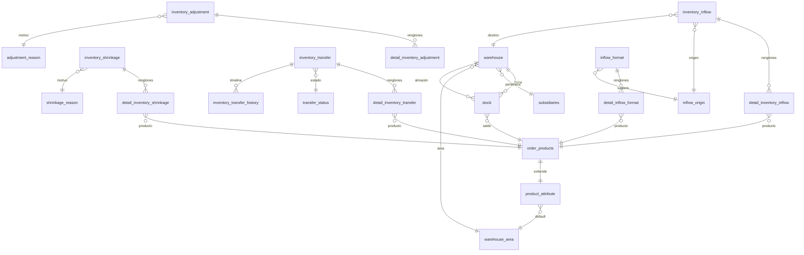

# Resumen de la Propuesta de BD — Módulo Inventarios

## 🎯 Objetivo
Persistir catálogos, productos, stock, eventos y bitácora de movimientos para Huubie Inventarios, dentro del schema **`fayxzvov_reginas`** (ya existe, convive con `order_products`).

---

## 📦 1. Catálogos del módulo (9 tablas)

| Tabla | Función |
|---|---|
| `warehouse` | Almacenes físicos por sucursal (1 default por sucursal) |
| `warehouse_area` | Áreas internas: Refrigerados, Secos, Congelados |
| `product_attribute` | Extensión 1:1 de `order_products` (SKU, vida útil, stock min/max, costo) |
| `supplier` | Proveedores externos |
| `unit` | Unidades de medida (pza, kg, lt, caja) |
| `inflow_origin` | Origen de entrada: Producción, Proveedor, Transferencia, Devolución |
| `shrinkage_reason` | Motivos de merma: Caducidad, Dañado, Robo, Error producción |
| `adjustment_reason` | Motivos de ajuste: Faltante, Conteo físico, Cierre mensual |
| `transfer_status` | Estados del flujo de traspaso: Solicitado → Autorizado → En Tránsito → Recibido/Rechazado |

---

## 📊 2. Stock vivo
- **`stock`**: saldo `quantity` por `(product_id, warehouse_id)`. Se actualiza al aplicar eventos.

---

## 🔄 3. Eventos POS (4 pares raíz + renglones)

| Raíz | Detalle | Folio | Signo | Impacto stock |
|---|---|---|---|---|
| `inventory_inflow` | `detail_inventory_inflow` | `ENT-####` | + | Sube |
| `inventory_shrinkage` | `detail_inventory_shrinkage` | `M-####` | − | Baja |
| `inventory_transfer` | `detail_inventory_transfer` | `TRA-####` | ± | Origen baja / destino sube |
| `inventory_adjustment` | `detail_inventory_adjustment` | `AJU-####` | ± | Corrige |

Cada renglón guarda **snapshot**: `previous_stock`, `resulting_stock`, `cost_unit` (trazabilidad histórica).

---

## 📝 4. Trazabilidad del traspaso
- **`inventory_transfer_history`**: una fila por transición de estado (timeline con usuario + fecha).

---

## 🔍 5. Bitácora unificada
- **`inventory_movement`** (vista): `UNION ALL` de todos los eventos → alimenta el visor de Movimientos.

---

## 📋 6. Formatos preguardados (2 tablas)

| Tabla | Función |
|---|---|
| `inflow_format` | Plantilla reutilizable de entrada (cabecera) |
| `detail_inflow_format` | Renglones precargados del formato |

**Reglas clave:**
- `scope ENUM('user','subsidiary','company')` — visibilidad del formato.
- **No se persiste `cost`** — se resuelve en runtime desde `product_attribute.cost_unit`.
- Solo aplica a entradas (no a mermas/traspasos/ajustes).

---

## ⚙️ 7. Convenciones técnicas

- **Nombres de tabla**: singular inglés snake_case.
- **Montos**: `DOUBLE` (no DECIMAL).
- **FKs**: al final de cada tabla (`ibfk_<n>`).
- **Prefijos `detail_`**: solo en renglones de eventos raíz.
- **Soft-delete**: columna `active TINYINT(1)`.
- **Timestamps**: `created_at`, `updated_at` (con `ON UPDATE`).
- **FKs cross-schema** (plurales por legado del ecosistema): `subsidiaries_id`, `companies_id`, `user_id`, `employee_id`.
- **FKs locales** (singular): `product_id`, `warehouse_id`, etc.

---

## 📐 8. Diagrama de relaciones (resumen visual)

---

## 🚦 9. Estado actual

| Fase | Estado | Fecha |
|---|---|---|
| **Fase 1 (POS)** | ✅ Ejecutada | 2026-05-29 |
| Migración producción pendiente | ✅ Aplicada | 2026-06-01 |
| **Fase 2 (Insumos)** | ⏳ Pendiente | — |

Las tablas `supply_*` (Fase 2) replican la estructura POS con prefijo distinto y folios `*-INS-####`.

---

**En una frase:** 18 tablas organizadas en catálogos + stock vivo + 4 pares de eventos (entrada/merma/traspaso/ajuste) + plantillas, con snapshots por renglón y bitácora unificada para auditar todo lo que pasa en el inventario.