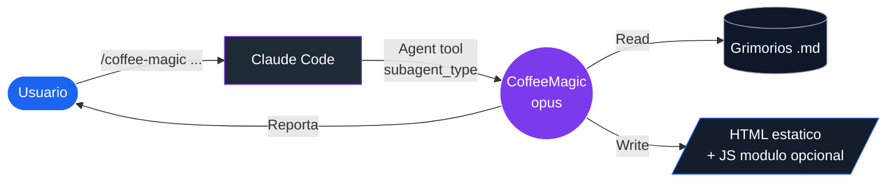
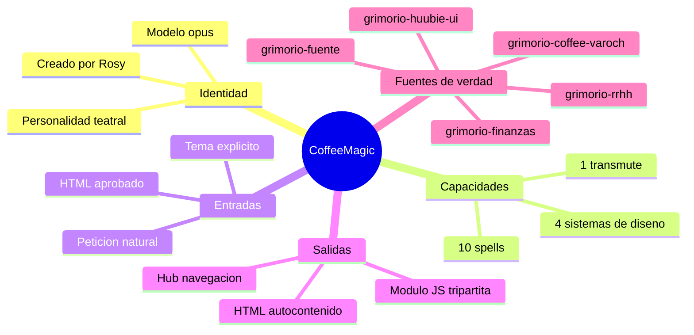
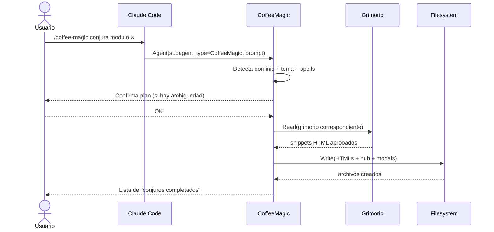
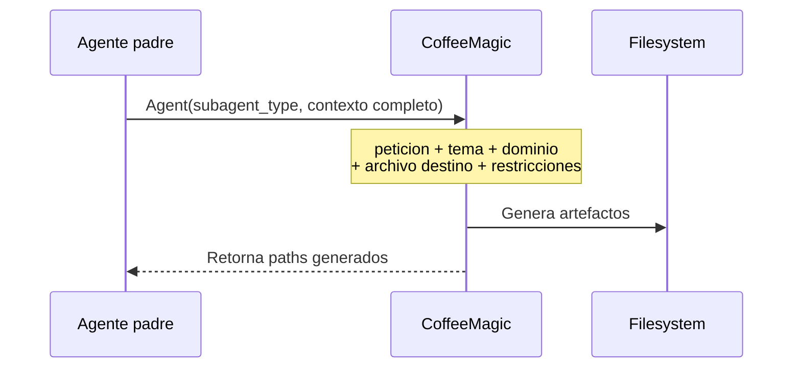
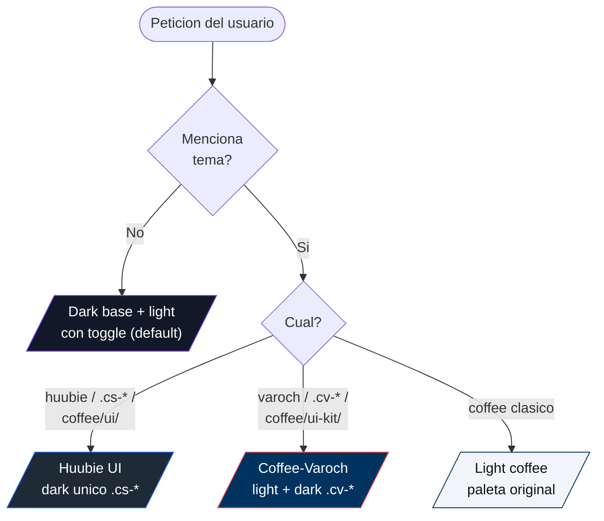
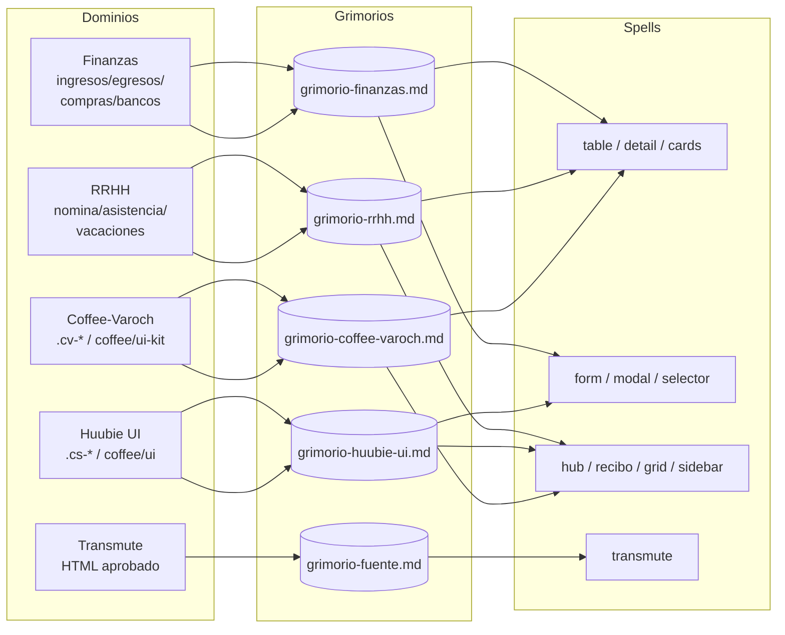
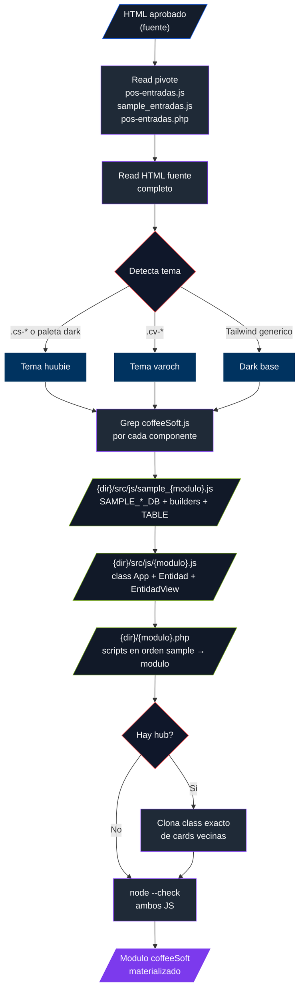
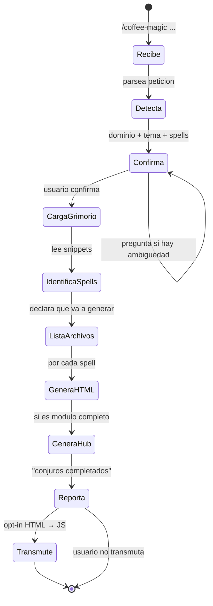

# CoffeeMagic — Mapa visual

> Complemento grafico de [coffee-magic-guia.md](coffee-magic-guia.md). Aqui vive el "como funciona" en diagramas.

---

## Tabla de contenido

1. [Vista de 10,000 pies](#1-vista-de-10000-pies)
2. [Anatomia del agente](#2-anatomia-del-agente)
3. [Flujo de invocacion](#3-flujo-de-invocacion)
4. [Arbol de decision de tema](#4-arbol-de-decision-de-tema)
5. [Mapeo dominio → grimorio → spells](#5-mapeo-dominio--grimorio--spells)
6. [Catalogo visual de spells](#6-catalogo-visual-de-spells)
7. [Pipeline del spell `transmute`](#7-pipeline-del-spell-transmute)
8. [Estructura de salida](#8-estructura-de-salida)
9. [Ciclo de vida de una peticion](#9-ciclo-de-vida-de-una-peticion)
10. [Reglas siempre / nunca](#10-reglas-siempre--nunca)

---

## 1. Vista de 10,000 pies



**Idea central:** CoffeeMagic es un sub-proceso especializado que lee grimorios, escribe HTML coherente y opcionalmente lo transmuta en modulo JS coffeeSoft.

---

## 2. Anatomia del agente



---

## 3. Flujo de invocacion

### Invocacion directa por usuario



### Invocacion delegada desde otro agente



---

## 4. Arbol de decision de tema



### Paletas en comparacion

```text
┌──────────────────────┬──────────────────────┬──────────────────────┐
│   DARK BASE          │   HUUBIE UI          │   COFFEE-VAROCH      │
├──────────────────────┼──────────────────────┼──────────────────────┤
│ bg-main   #111928    │ Dark unico           │ --cv-primary #003360 │
│ bg-card   #1F2A37    │ Clases .cs-*         │ --cv-secondary F24444│
│ bg-input  #1a2332    │ ui-kit.css           │ --cv-success  7AAB20 │
│ bg-header #141d2b    │ NO toggle            │ --cv-action   2563EB │
│ accent    #7c3aed    │ Hub coffee/ui/       │ Light+Dark con body  │
│ btn       #1c64f2    │                      │ class="coffee-varoch"│
└──────────────────────┴──────────────────────┴──────────────────────┘
```

---

## 5. Mapeo dominio → grimorio → spells



### Resolucion de ubicacion del grimorio

```text
┌─────────────────────────────────────────────────────────────┐
│  1. Global del usuario                                      │
│     ~/.claude/agents/grimorios/[grimorio].md                │
│                          ↓ (si no existe)                   │
│  2. Local del proyecto                                      │
│     .claude/agents/grimorios/[grimorio].md                  │
│                          ↓ (si no existe)                   │
│  3. Fallback                                                │
│     Glob "**/grimorio-[nombre].md"                          │
└─────────────────────────────────────────────────────────────┘
```

---

## 6. Catalogo visual de spells

```text
┌─ 1. conjure table ────────────────┐  ┌─ 2. conjure detail ───────────────┐
│ ┌─────┬──────────────────────────┐│  │ ┌────────────┐ ┌──────────────┐  │
│ │     │ Header + filtros         ││  │ │            │ │ Panel detalle│  │
│ │ Sb  ├──────────────────────────┤│  │ │   Tabla    │ │  w-[420px]   │  │
│ │     │  ▣▣▣  Tabla sticky      ││  │ │ reducida   │ │  badges      │  │
│ │     │  ▣▣▣                    ││  │ │            │ │  grid k-v    │  │
│ │     │  Showing X-Y of Z       ││  │ │            │ │  footer btns │  │
│ └─────┴──────────────────────────┘│  │ └────────────┘ └──────────────┘  │
└───────────────────────────────────┘  └───────────────────────────────────┘

┌─ 3. conjure cards (dashboard) ────┐  ┌─ 4. conjure form ─────────────────┐
│ ┌─────┬──────────────────────────┐│  │       ┌────────────────────┐      │
│ │     │ ▢ KPI │ ▢ KPI │ ▢ KPI   ││  │       │ Label              │      │
│ │ Sb  ├──────────────────────────┤│  │       │ [ input.input-modal│      │
│ │     │ ▢ KPI │ ▢ KPI │ ▢ KPI   ││  │       │ Label              │      │
│ │     │ Chart.js + tabla resumen││  │       │ [ input            │      │
│ └─────┴──────────────────────────┘│  │       │  [Enviar][Cancelar]│      │
└───────────────────────────────────┘  └───────────────────────────────────┘

┌─ 5. conjure modal ────────────────┐  ┌─ 6. conjure selector ─────────────┐
│       ░░░░░ bg-black/60 ░░░░░     │  │     ┌────────────────────┐        │
│      ┌────────────────────┐       │  │     │ Titulo             │        │
│      │ Titulo        X    │       │  │     │ ┌────┐ ┌────┐      │        │
│      │ Contenido          │       │  │     │ │opc1│ │opc2│ grid │        │
│      │ ......             │       │  │     │ ├────┤ ├────┤      │        │
│      │ [Cancelar][Aceptar]│       │  │     │ │opc3│ │opc4│      │        │
│      └────────────────────┘       │  │     │     [Aceptar]      │        │
└───────────────────────────────────┘  └───────────────────────────────────┘

┌─ 7. conjure hub ──────────────────┐  ┌─ 8. conjure recibo ───────────────┐
│  Categoria A                      │  │  ┌──────────────────────────────┐ │
│  ┌──────┐ ┌──────┐ ┌──────┐       │  │  │  Logo    Recibo  #folio      │ │
│  │ card │ │ card │ │ card │       │  │  │  ─────────────────────────   │ │
│  └──────┘ └──────┘ └──────┘       │  │  │  Datos grid 2 cols           │ │
│  Categoria B                      │  │  │  ─────────────────────────   │ │
│  ┌──────┐ ┌──────┐                │  │  │  Tabla desglose              │ │
│  │ card │ │ card │                │  │  │  ─────────────────────────   │ │
│  └──────┘ └──────┘                │  │  │  Resumen     │ Items panel   │ │
└───────────────────────────────────┘  └──┴──────────────┴───────────────┘──┘

┌─ 9. conjure grid (calendario) ────┐  ┌─ 10. conjure sidebar ─────────────┐
│            01  02  03  04  05     │  │ ┌────────┐                       │
│  Empl A    ●   ●   ○   ●   ●      │  │ │  Logo  │                       │
│  Empl B    ○   ●   ●   ●   ○      │  │ ├────────┤                       │
│  Empl C    ●   ●   ●   ○   ●      │  │ │ ⬚ Menu │ w-56 (224px)          │
│  click → dropdown contextual      │  │ │ ⬚ Menu │ iconos SVG            │
│  dots de color por estado         │  │ │   ⬚ sub│ submenu expandible   │
│                                   │  │ ├────────┤                       │
│                                   │  │ │ ⚙ ⏻ 👤 │ footer                │
└───────────────────────────────────┘  │ └────────┘                       │
                                       └──────────────────────────────────┘
```

---

## 7. Pipeline del spell `transmute`



### Sintaxis YAML del transmute

```text
       OBLIGATORIO              OPCIONAL (con default/auto-detect)
       ───────────────          ──────────────────────────────────
fuente:      [ruta HTML]   ──►  project:     [PascalCase] (se infiere)
modulo:      [kebab-case]  ──►  referencia:  [ruta JS pivote]
                                tema:        huubie|varoch|dark
                                hub:         [ruta HTML hub]
                                card_label:  [texto card]
                                card_icon:   [lucide icon]
```

---

## 8. Estructura de salida

```text
[nombre-modulo]/
│
├── templates/
│   │
│   ├── [modulo]-index-navegacion.html   ◄── HUB (siempre, si es modulo completo)
│   │
│   ├── [modulo]-[seccion].html          ◄── Templates principales
│   │      └─ ej: ingresos.html, egresos.html
│   │
│   ├── [modulo]-[seccion]-detalle.html  ◄── Vistas detalle (panel lateral)
│   │      └─ ej: ingresos-detalle.html
│   │
│   └── modals/                          ◄── Modales aislados
│       ├── modal-nuevo-registro.html
│       ├── modal-confirmacion.html
│       └── modal-[selector].html
│
└── (si paso por transmute)
    │
    ├── src/js/
    │   ├── sample_[modulo].js           ◄── helpers + SAMPLE_*_DB + builders
    │   └── [modulo].js                  ◄── App + Entidad + EntidadView
    │
    └── [modulo].php                     ◄── entry-point (sample antes que modulo)
```

---

## 9. Ciclo de vida de una peticion



---

## 10. Reglas siempre / nunca

```text
┌────────────────────────── SIEMPRE ──────────────────────────┐
│ ✓  Tailwind via CDN + Inter (Google Fonts)                  │
│ ✓  HTML autocontenido (cada archivo standalone)             │
│ ✓  Hub index-navegacion.html cuando es modulo completo      │
│ ✓  Modales en subcarpeta modals/                            │
│ ✓  Sidebar + header + subheader consistentes                │
│ ✓  Tablas con sticky thead + hover states                   │
│ ✓  Badges patron bg-[color]-500/15 text-[color]-400         │
│ ✓  Tablas en light: fondo blanco #ffffff aunque body sea gris│
│ ✓  Sin tema mencionado → light + dark con toggle            │
└─────────────────────────────────────────────────────────────┘

┌────────────────────────── NUNCA ────────────────────────────┐
│ ✗  JS funcional mas alla de theme toggle / window.close()   │
│ ✗  Backend (PHP, APIs) — son demos estaticos                │
│ ✗  Inferir tema/dominio si hay ambiguedad — confirma primero│
│ ✗  Banners `// ════` ni descriptores `// Clase: X hace Y`   │
│ ✗  Tildes en strings de codigo                              │
│ ✗  Mezclar Huubie UI con Coffee-Varoch sin pedido explicito │
└─────────────────────────────────────────────────────────────┘

┌─────────────── REGLAS EXCLUSIVAS DE `transmute` ────────────┐
│ ✓  Lectura COMPLETA del pivote antes de transmutir          │
│ ✓  Grep en coffeeSoft.js por cada componente local          │
│ ✓  SAMPLE_* al top del archivo sample                       │
│ ✓  .php carga sample ANTES del modulo principal             │
│ ✓  node --check pasa en ambos JS sin errores                │
└─────────────────────────────────────────────────────────────┘
```

---

## Leyenda de simbolos

| Simbolo | Significado |
|---|---|
| `(())` | Agente / proceso vivo |
| `[/  /]` | Entrada o salida (datos / archivos) |
| `[( )]` | Almacen de datos (grimorio, BD) |
| `{ }` | Decision |
| `[ ]` | Paso o estado |
| `►` / `→` | Flujo direccional |
| `▣` | Filas de tabla |
| `▢` | Card / KPI |
| `●` / `○` | Estado activo / inactivo en grid |
| `░░` | Overlay translucido |

---

> *"Los diagramas son los hechizos visualizados — sin ellos, el grimorio es solo tinta dormida."* — ✨☕ 🌹
