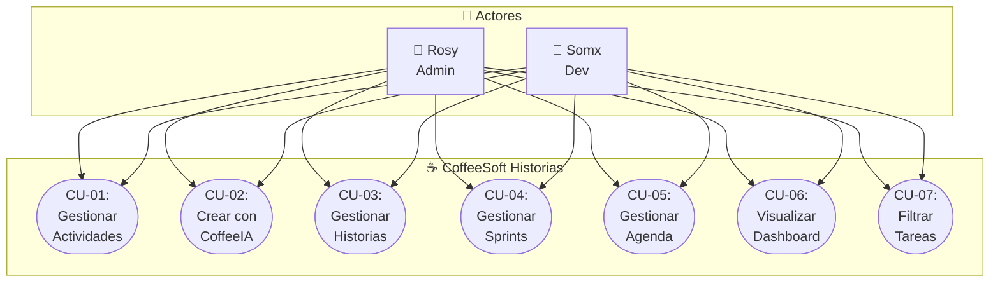

# ☕ CoffeeSoft Historias de Usuario - Casos de Uso

## Descripción General

Sistema de gestión de tareas, sprints y historias de usuario para el equipo de desarrollo CoffeeSoft.

---

## Actores

| Actor | Rol | Descripción |
|-------|-----|-------------|
| 👤 **Rosy** | Admin | Gestiona y supervisa el desarrollo de proyectos |
| 👤 **Somx** | Dev | Desarrolla funcionalidades y reporta avances |

---

## Diagrama de Casos de Uso



---

## Catálogo de Casos de Uso

### CU-01: Gestionar Actividades

| Campo | Descripción |
|-------|-------------|
| **Actor** | Rosy, Somx |
| **Propósito** | Crear, editar, visualizar y eliminar tareas de desarrollo |
| **Precondición** | Usuario ha iniciado sesión |

**Flujo Principal:**
1. Usuario navega a "Actividades" desde el sidebar
2. Sistema muestra tabla con todas las tareas
3. Usuario aplica filtros (buscar, empresa, clasificación, módulo, estado)
4. Usuario hace clic en "+ Nueva Tarea"
5. Sistema muestra formulario con campos
6. Usuario completa campos y guarda
7. Sistema registra la tarea y actualiza la tabla

**Campos del Formulario:**
- Título
- Objetivo (Para qué)
- Lista (Actividades/Sprints/Historias)
- Fecha de entrega
- Quién lo hará
- Clasificación (Bug/Feature/Mejora/Documentación)
- Empresa (CoffeeSoft/Huubie/ERP-GV)
- Módulo (Finanzas/RRHH/Pedidos/Inventario/Auth)
- Dependencia de otras tareas

**Flujos Alternativos:**
- 4a. Editar: Carga datos existentes → modifica → guarda
- 4b. Eliminar: Muestra confirmación → confirma → elimina
- 4c. Ver: Muestra detalle completo de la tarea

---

### CU-02: Crear Tarea con CoffeeIA

| Campo | Descripción |
|-------|-------------|
| **Actor** | Rosy, Somx |
| **Propósito** | Generar tareas asistidas por inteligencia artificial |
| **Precondición** | Usuario está en la vista de Actividades |

**Flujo Principal:**
1. Usuario hace clic en "Crear con CoffeeIA"
2. Sistema muestra modal con campo de texto libre
3. Usuario describe su necesidad
4. CoffeeIA analiza y sugiere campos automáticamente
5. Sistema muestra preview de campos sugeridos
6. Usuario acepta y crea la tarea

**Campos Sugeridos por IA:**
- Título
- Clasificación
- Módulo
- Empresa
- Asignado

**Flujos Alternativos:**
- 6a. Usuario modifica campos antes de crear
- 6b. Usuario cancela la operación

---

### CU-03: Gestionar Historias de Usuario

| Campo | Descripción |
|-------|-------------|
| **Actor** | Rosy, Somx |
| **Propósito** | Definir funcionalidades mediante formato de historias de usuario |
| **Precondición** | Existe una tarea padre seleccionada |

**Flujo Principal:**
1. Usuario navega a "Historias" desde el sidebar
2. Sistema muestra tarea padre y tabla de historias
3. Usuario hace clic en "+ Nueva Historia"
4. Usuario completa campos:
   - **Usuario:** (ej: "dev", "rosi y somx")
   - **Quiero:** Funcionalidad deseada
   - **Para qué:** Beneficio u objetivo
   - **Criterios de Aceptación:** Condiciones de validación
5. Sistema guarda la historia

**Flujos Alternativos:**
- 3a. "Mejorar con IA": Sistema redacta/mejora automáticamente
- 3b. Editar historia existente
- 3c. Eliminar historia (con confirmación)

---

### CU-04: Gestionar Sprints

| Campo | Descripción |
|-------|-------------|
| **Actor** | Rosy, Somx |
| **Propósito** | Organizar trabajo en iteraciones con subtareas asignadas |
| **Precondición** | Usuario autenticado |

**Flujo Principal:**
1. Usuario navega a "Sprints"
2. Sistema muestra dos secciones:
   - **Administrar Sprints:** Nombre, rango de fechas, contador de subtareas
   - **Subtareas:** Título, asignados, estado, sprint, rango, días faltantes
3. Usuario crea sprint (nombre + rango de fechas)
4. Sistema registra el sprint
5. Usuario agrega subtarea al sprint
6. Sistema calcula y muestra días restantes

**Flujos Alternativos:**
- 5a. Eliminar sprint → elimina sprint y sus subtareas
- 5b. Eliminar subtarea individual → actualiza contador

---

### CU-05: Gestionar Agenda

| Campo | Descripción |
|-------|-------------|
| **Actor** | Rosy, Somx |
| **Propósito** | Planificar actividades por fecha |
| **Precondición** | Usuario autenticado |

**Flujo Principal:**
1. Usuario navega a "Agenda"
2. Sistema muestra 3 columnas: Hoy, Mañana, Calendario mensual
3. Usuario agrega actividad:
   - Selecciona actividad del dropdown
   - Define estado (Pendiente/En progreso/Completada)
4. Sistema guarda la asignación
5. Usuario navega entre fechas con flechas

**Flujos Alternativos:**
- 3a. Asigna actividad a "Mañana"
- 3b. Selecciona fecha en calendario → carga actividades
- 3c. Elimina actividad → remueve de la agenda

---

### CU-06: Visualizar Dashboard

| Campo | Descripción |
|-------|-------------|
| **Actor** | Rosy, Somx |
| **Propósito** | Obtener vista general del estado del proyecto |
| **Precondición** | Usuario autenticado |

**Flujo Principal:**
1. Usuario ingresa al sistema
2. Sistema muestra:
   - 4 cards de acceso rápido (Agenda, Actividades, Historias, Sprints)
   - 4 KPIs: Total Actividades, En Progreso, Sprints Activos, Historias Creadas
3. Usuario hace clic en cualquier card para navegar

---

### CU-07: Filtrar y Buscar Tareas

| Campo | Descripción |
|-------|-------------|
| **Actor** | Rosy, Somx |
| **Propósito** | Localizar tareas específicas mediante múltiples criterios |
| **Precondición** | Usuario está en la vista de Actividades |

**Flujo Principal:**
1. Usuario ingresa términos en campo "Buscar"
2. Sistema filtra en tiempo real por título
3. Usuario selecciona filtros adicionales:
   - Empresa (Todas/CoffeeSoft/Huubie/ERP-GV)
   - Clasificación (Todas/Bug/Feature/Mejora)
   - Módulo (Todos/Finanzas/RRHH/Pedidos/Inventario/Auth)
   - Estado (Todos/Pendiente/En progreso/Completada/Cancelada)
4. Sistema actualiza tabla con resultados

---

## Resumen de Funcionalidades

| Caso de Uso | Crear | Leer | Actualizar | Eliminar |
|-------------|-------|------|------------|----------|
| CU-01 Actividades | ✅ | ✅ | ✅ | ✅ |
| CU-02 CoffeeIA | ✅ | - | - | - |
| CU-03 Historias | ✅ | ✅ | ✅ | ✅ |
| CU-04 Sprints | ✅ | ✅ | ✅ | ✅ |
| CU-05 Agenda | ✅ | ✅ | ✅ | ✅ |
| CU-06 Dashboard | - | ✅ | - | - |
| CU-07 Filtros | - | ✅ | - | - |

---

## Navegación del Sistema

```
┌─────────────────────────────────────────────────────────┐
│                    DASHBOARD                            │
│  [Agenda] [Actividades] [Historias] [Sprints]          │
└─────────────────────────────────────────────────────────┘
                          │
         ┌────────────────┼────────────────┐
         ▼                ▼                ▼
   ┌──────────┐    ┌──────────┐    ┌──────────┐
   │Actividades│    │ Historias │    │  Sprints │
   │  Tabla    │    │  Tabla    │    │  Gestión │
   │  Formulario│   │  IA Help  │    │  Subtareas│
   └──────────┘    └──────────┘    └──────────┘
         │
         ▼
   ┌──────────┐
   │  Agenda   │
   │Hoy|Mañana │
   │Calendario │
   └──────────┘
```

---

*Documento generado para CoffeeSoft Historias de Usuario - 2026*
