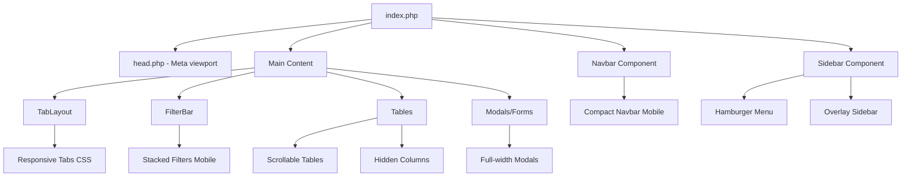

# Design Document: Almacén Responsive

## Overview

Este diseño técnico describe la implementación de mejoras responsive para el módulo de Almacén del sistema CoffeeSoft. El objetivo es garantizar una experiencia de usuario óptima en dispositivos móviles, tablets y escritorio, manteniendo la funcionalidad completa del sistema.

La solución se basa en:
- TailwindCSS para estilos responsive (ya incluido en el proyecto)
- Modificaciones a los componentes JavaScript existentes
- CSS personalizado para casos específicos
- Ajustes en la estructura HTML del layout

## Architecture



## Components and Interfaces

### 1. CSS Responsive File (almacen-responsive.css)

Nuevo archivo CSS con media queries específicas para el módulo:

```css
/* Breakpoints:
   - sm: 640px
   - md: 768px  
   - lg: 1024px
*/

/* Mobile-first approach */
```

### 2. Navbar Component Updates

**Archivo:** `acceso/src/js/navbar.js`

Modificaciones:
- Agregar clase `navbar-mobile` para estilos compactos
- Reducir padding en móvil
- Ocultar elementos no esenciales

### 3. Sidebar Component Updates

**Archivo:** `acceso/src/js/sidebar.js`

Modificaciones:
- Agregar botón hamburguesa
- Implementar overlay mode
- Auto-close al seleccionar item

### 4. FilterBar Responsive

**Componente:** `createfilterBar()` en CoffeeSoft

Comportamiento responsive:
- Desktop: Elementos en fila (grid)
- Mobile: Elementos apilados (flex-col)

### 5. Table Responsive

**Componente:** `createTable()` / `createCoffeTable()`

Comportamiento responsive:
- Contenedor con overflow-x: auto
- Columnas prioritarias visibles
- Botones de acción compactos

### 6. Modal Forms Responsive

**Componente:** `createModalForm()`

Comportamiento responsive:
- Width: 95vw en móvil
- Campos full-width
- Botones apilados

## Data Models

No se requieren cambios en los modelos de datos. Las modificaciones son puramente de presentación (CSS/JS).

## Correctness Properties

*A property is a characteristic or behavior that should hold true across all valid executions of a system-essentially, a formal statement about what the system should do. Properties serve as the bridge between human-readable specifications and machine-verifiable correctness guarantees.*

### Property 1: Filter bar stacking on mobile
*For any* filter bar component rendered on a viewport width less than 768px, all filter elements should be displayed in a vertical stack with 100% width.
**Validates: Requirements 1.2**

### Property 2: Tab container horizontal scroll
*For any* tab layout component on a viewport width less than 768px, the tab container should have overflow-x set to auto or scroll.
**Validates: Requirements 1.3**

### Property 3: Table horizontal scroll enabled
*For any* table component on a viewport width less than 768px, the table container should enable horizontal scrolling.
**Validates: Requirements 3.1**

### Property 4: Table font size reduction
*For any* table cell on a viewport width less than 640px, the computed font-size should be 12px or less.
**Validates: Requirements 3.2**

### Property 5: Modal width on mobile
*For any* modal form displayed on a viewport width less than 768px, the modal width should be at least 90% of viewport width.
**Validates: Requirements 4.1**

### Property 6: Form fields full width on mobile
*For any* form field in a modal on a viewport width less than 768px, the field should occupy 100% of the available width.
**Validates: Requirements 4.2**

### Property 7: Info cards grid layout
*For any* info cards container on a viewport width less than 768px, the grid should display 2 columns, and on width less than 640px, should display 1 column.
**Validates: Requirements 6.1, 6.2**

### Property 8: Touch target minimum size
*For any* clickable button or interactive element, the minimum dimensions should be 44x44 pixels.
**Validates: Requirements 7.1**

## Error Handling

### Viewport Detection Fallback
Si el navegador no soporta media queries CSS, el sistema debe:
1. Mostrar la versión desktop por defecto
2. Mantener funcionalidad completa sin estilos responsive

### Touch Event Fallback
Para navegadores sin soporte de touch events:
1. Mantener eventos click estándar
2. No bloquear interacciones con hover-only

### Overflow Handling
Para tablas con muchas columnas:
1. Siempre mostrar scroll indicator visual
2. Mantener columnas de acción visibles

## Testing Strategy

### Dual Testing Approach

#### Unit Tests
- Verificar que los archivos CSS se cargan correctamente
- Verificar que las clases responsive se aplican
- Verificar que los breakpoints están definidos

#### Property-Based Tests
Se utilizará **Playwright** para testing de propiedades responsive:

1. **Viewport Testing**: Generar múltiples tamaños de viewport y verificar que los estilos se aplican correctamente
2. **Element Visibility**: Verificar que elementos se muestran/ocultan según breakpoint
3. **Layout Testing**: Verificar que los layouts cambian según el viewport

### Test Configuration
- Mínimo 100 iteraciones por propiedad
- Viewports de prueba: 320px, 375px, 414px, 640px, 768px, 1024px, 1280px
- Dispositivos simulados: iPhone SE, iPhone 12, iPad, Desktop

### Test Annotations
Cada test debe incluir:
```javascript
// **Feature: almacen-responsive, Property {number}: {property_text}**
```

## Implementation Notes

### CSS Strategy
1. Usar clases de TailwindCSS existentes cuando sea posible
2. Crear archivo CSS adicional solo para casos específicos
3. Evitar `!important` excepto para overrides de librerías externas

### JavaScript Strategy
1. Detectar viewport con `window.matchMedia()`
2. Usar event delegation para touch events
3. Implementar debounce en resize handlers

### Performance Considerations
1. Lazy load de estilos responsive
2. Evitar reflows innecesarios
3. Usar CSS transforms para animaciones

